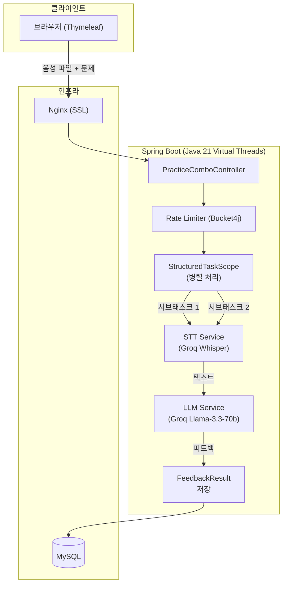

<h1 align="center">Opicnic: OPIc AI 모의고사 & 피드백 서비스</h1>
<p align="center">
  <b>음성 답변을 STT로 변환하고 LLM이 항목별 피드백 리포트를 생성하는 OPIc 대비 플랫폼</b><br>
  Java 21 가상 스레드 기반 음성 처리 파이프라인 최적화
</p>

<p align="center">
  
  
  
  
</p>

---

## 프로젝트 개요

Opicnic은 사용자가 OPIc 시험 형식으로 음성 답변을 제출하면, **STT(Groq Whisper)로 텍스트 변환 후 LLM(Llama-3.3-70b)이 어휘·문법·유창성·내용 등 6개 항목의 피드백 리포트를 생성**하는 서비스입니다. 다수의 음성 파일을 동시에 처리하는 I/O 집약적 워크로드에서 지연 시간을 최소화하는 데 집중했습니다.

---

## 성능 최적화 성과

> 500 VU 동시 부하 환경에서 p95 응답 지연 1,130ms → 238ms 달성 과정

| 측정 항목 | 최적화 전 | 최적화 후 | 비고 |
| :--- | :---: | :---: | :--- |
| **p95 Latency** | **1,130ms** | **238ms** | **약 79% 단축** |
| **처리량 (RPS)** | 96 | 242 | 가상 스레드 전환 후 2.5배 향상 |
| **병목 원인** | 디스크 I/O Wait | 제거됨 | JFR 프로파일링으로 확정 |

<details>
<summary><b>병목 분석 과정 상세</b></summary>

- **1단계 (가설 수립)**: 500 VU 도달 시 p95 1,130ms 고착 현상 발생. DB 커넥션 부족 가설로 풀 사이즈 10 → 50 확장했으나 지표 변화 없음. DB 병목 가설 기각.
- **2단계 (격리 실험)**: 1MB 음성 파일을 1KB로 교체한 부하 테스트에서 p95 132ms로 급감 → 병목이 파일 I/O임을 논리적으로 확정.
- **3단계 (JFR 물리적 증거)**: Java Flight Recorder 프로파일링으로 `jdk.ObjectAllocationSample`에서 대규모 byte[] 복사와 톰캣 디스크 쓰기 이벤트 포착. 기본 멀티파트 임계치(10KB)를 초과하는 파일이 디스크 I/O Wait를 유발함을 물리적으로 증명.
- **해결**: `file-size-threshold: 2MB` 설정으로 디스크 쓰기 제거, InputStream 릴레이 구조로 메모리 직접 스트리밍.
</details>

---

## 시스템 아키텍처



---

## 핵심 엔지니어링 사례

### 1. Java 21 Structured Concurrency를 통한 병렬 처리 및 에러 전파

OPIc 콤보는 2~3개 질문으로 구성되며, 각 질문마다 STT → LLM 순서로 처리됩니다. 순차 처리 시 응답 시간이 문항 수에 비례해 증가하는 문제를 `StructuredTaskScope.ShutdownOnFailure`로 해결했습니다.

하위 작업 중 하나가 실패하면 나머지 작업을 즉시 취소하고 부모에게 에러를 전파합니다. 실패한 서브태스크는 최대 3회 재시도를 독립적으로 수행합니다. 실패 시 전체 오류 대신 해당 문항만 실패 카드로 반환하여 부분 결과를 보존합니다.

### 2. In-memory 스트리밍으로 디스크 I/O 제거

톰캣은 멀티파트 파일이 기본 임계치(10KB)를 초과하면 디스크에 임시 파일을 씁니다. 음성 파일(수백KB~수MB)은 항상 이 임계치를 초과하므로 모든 요청에서 디스크 I/O Wait가 발생했습니다.

`file-size-threshold: 2MB` 설정으로 디스크 쓰기 없이 메모리에서 InputStream을 직접 STT API로 릴레이하는 구조로 전환, p95 지연 1,130ms → 238ms 달성.

### 3. Rate Limiting으로 외부 API 비용 제어

Groq API는 사용량 기반 과금이므로 무제한 요청은 비용 폭발을 유발합니다. Bucket4j로 사용자 ID 기반 10회/시간 제한을 적용하여 외부 API 호출을 제어합니다.

---

## 기술 스택

| 분류 | 기술 |
|------|------|
| Language | Java 21 |
| Framework | Spring Boot 3.4 |
| Concurrency | Virtual Threads, StructuredTaskScope |
| AI | Groq Whisper (STT), Groq Llama-3.3-70b (LLM) |
| Database | MySQL, Spring Data JPA |
| Auth | Spring Security OAuth2 (카카오) |
| Rate Limiting | Bucket4j |
| Infra | Docker, Nginx, Let's Encrypt, Oracle Cloud (ARM A1) |
| Monitoring | Spring Actuator, Micrometer (Prometheus) |

---

## 로컬 실행

```bash
# 1. MySQL 실행
docker-compose up -d

# 2. 환경변수 설정
export GROQ_API_KEY=your_groq_api_key

# 3. 앱 실행
./gradlew bootRun
```

`STT_ENABLED=false`, `LLM_ENABLED=false` 설정 시 외부 API 없이 Mock 응답으로 동작합니다.

## 배포

Oracle Cloud (ARM Ampere A1) + DuckDNS + Nginx + Let's Encrypt 기반 단일 서버 배포.

```bash
cp .env.example .env   # 환경변수 작성 (.env.example 참고)
./deploy.sh            # SSL 인증서 발급 + Docker Compose 배포
```
