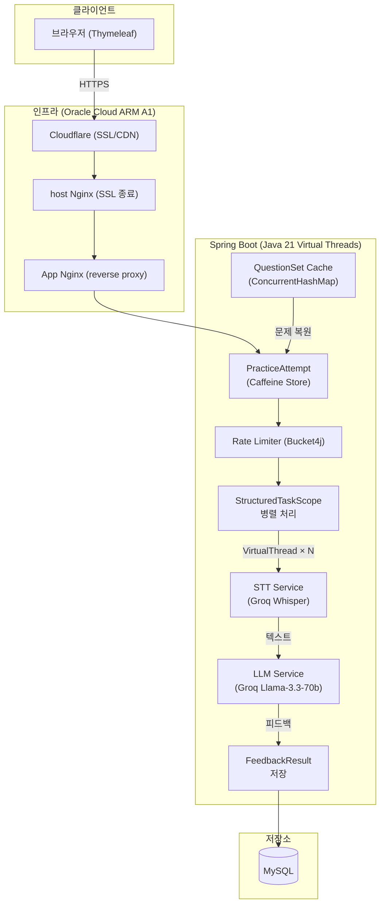

<h1 align="center">Opicnic</h1>
<p align="center">
  <b>OPIc 콤보 패턴 기반 AI 음성 피드백 서비스</b><br>
  음성 답변 → STT → LLM 항목별 피드백 | Java 21 Virtual Threads 기반 병렬 처리 파이프라인
</p>

<p align="center">
  
  
  
  
  
</p>

---

## 프로젝트 개요

Opicnic은 OPIc 시험 구조(콤보 I~V 패턴)에 맞춰 음성 답변을 제출하면, **STT(Groq Whisper)로 텍스트 변환 후 LLM(Llama-3.3-70b)이 어휘·문법·유창성·내용 등 6개 항목의 피드백 리포트를 생성**하는 서비스입니다.

다수의 음성 파일을 동시에 처리하는 I/O 집약적 워크로드에서 지연 시간을 최소화하는 데 집중했습니다. **opicnic.xyz** 에 배포되어 운영 중입니다.

---

## 성능 최적화 성과

### In-memory 스트리밍 + 가상 스레드

> 500 VU 동시 부하 환경에서 p95 응답 지연 1,130ms → 238ms 달성 과정

| 측정 항목 | 최적화 전 | 최적화 후 | 비고 |
| :--- | :---: | :---: | :--- |
| **p95 Latency** | **1,130ms** | **238ms** | **약 79% 단축** |
| **처리량 (RPS)** | 96 | 242 | 가상 스레드 전환 후 2.5배 향상 |
| **병목 원인** | 디스크 I/O Wait | 제거됨 | JFR 프로파일링으로 확정 |

<details>
<summary><b>병목 분석 과정 상세</b></summary>

- **1단계 (가설 수립)**: 500 VU 도달 시 p95 1,130ms 고착 현상 발생. DB 커넥션 부족 가설로 풀 사이즈 10 → 50 확장했으나 지표 변화 없음. DB 병목 가설 기각.
- **2단계 (격리 실험)**: 1MB 음성 파일을 1KB로 교체한 부하 테스트에서 p95 132ms로 급감 → 병목이 파일 I/O임을 논리적으로 확정.
- **3단계 (JFR 물리적 증거)**: Java Flight Recorder 프로파일링으로 `jdk.ObjectAllocationSample`에서 대규모 byte[] 복사와 톰캣 디스크 쓰기 이벤트 포착. 기본 멀티파트 임계치(10KB)를 초과하는 파일이 디스크 I/O Wait를 유발함을 물리적으로 증명.
- **해결**: `file-size-threshold: 2MB` 설정으로 디스크 쓰기 제거, InputStream 릴레이 구조로 메모리 직접 스트리밍.
</details>

### Structured Concurrency 병렬 처리 실측

> 동일 음성 파일 3문항 기준 순차 vs 병렬 직접 측정 (2026-06-05)

| 처리 방식 | 총 소요 시간 |
| :--- | :---: |
| 순차 (STT→LLM 직렬) | 4,877ms |
| **병렬 (StructuredTaskScope)** | **1,474ms** |
| **개선율** | **3.3배 (70% 단축)** |

병렬 총 소요는 가장 느린 subtask에 수렴. STT + LLM이 외부 API 대기(I/O bound)이므로 Virtual Thread가 대기 시간을 겹쳐서 처리.

---

## 시스템 아키텍처



---

## 핵심 엔지니어링 사례

### 1. Java 21 Structured Concurrency — 병렬 처리 및 에러 전파

OPIc 콤보는 2~3개 질문으로 구성되며, 각 질문마다 STT → LLM 순서로 처리됩니다. `StructuredTaskScope.ShutdownOnFailure`로 N개 질문을 동시에 처리합니다.

하위 작업 중 하나가 실패해도 나머지 결과는 보존하고, 실패 문항만 `failedIndexes`로 반환합니다. 클라이언트는 보관 중인 녹음 Blob으로 실패 문항만 재제출합니다.

실측 결과: 3문항 기준 **순차 4,877ms → 병렬 1,474ms (3.3배)**

### 2. In-memory 스트리밍으로 디스크 I/O 제거

톰캣은 멀티파트 파일이 기본 임계치(10KB)를 초과하면 디스크에 임시 파일을 씁니다. 음성 파일(수백KB~수MB)은 항상 이 임계치를 초과하므로 모든 요청에서 디스크 I/O Wait가 발생했습니다.

`file-size-threshold: 2MB` 설정으로 InputStream을 메모리에서 STT API로 직접 릴레이. **p95 지연 1,130ms → 238ms (79% 단축)**

### 3. PracticeAttempt — 서버 기반 세션 무결성

클라이언트가 제출 시 문제 내용을 함께 보내면 조작이 가능합니다. 문제풀이 시작 시 `attemptId`를 생성하고 `questionIds`를 서버(Caffeine)에 저장해, 제출 시 서버가 직접 DB에서 문제를 복원합니다.

음성 재시도 시에도 서버는 음성 원본을 보관하지 않습니다. 클라이언트가 보관 중인 Blob으로 실패 문항만 재전송합니다. Caffeine → Redis 교체 가능하도록 `PracticeAttemptStore` 인터페이스로 추상화했습니다.

### 4. OPIc 콤보 패턴 C1~C5 도메인 모델링

OPIc 공식 출제 구조(콤보 I~V)를 `ComboPattern` record로 모델링했습니다.

```java
public record ComboPattern(String name, List<QuestionType> questionTypes) {
    public String category() {
        if (questionTypes.contains(TYPE_6) || questionTypes.contains(TYPE_7)) return "C3";
        if (questionTypes.contains(TYPE_9) || questionTypes.contains(TYPE_10)) return "C5";
        if (questionTypes.contains(TYPE_5)) return "C4";
        if (questionTypes.contains(TYPE_4)) return "C2";
        return "C1";
    }
}
```

C3 판별이 우선순위를 가지는 이유: 콤보 III는 TYPE_6,7,4와 TYPE_6,7,8 두 종류가 있어 TYPE_4 포함 여부만으로 C2와 구분이 불가능합니다.

피드백 저장 시 `comboPatternKey`, `comboCategory`, `questionType`, `surveyTopicName`을 함께 저장해 학습 이력 분석 기반을 마련했습니다.

### 5. Rate Limiting으로 외부 API 비용 제어

Groq API는 사용량 기반 과금이므로 Bucket4j로 사용자 ID 기반 10회/시간 제한을 적용했습니다.

---

## 기술 스택

| 분류 | 기술 |
|------|------|
| Language | Java 21 |
| Framework | Spring Boot 3.4 |
| Concurrency | Virtual Threads, StructuredTaskScope |
| AI | Groq Whisper (STT), Groq Llama-3.3-70b (LLM) |
| Database | MySQL 8.0, Spring Data JPA |
| Cache | Caffeine (PracticeAttempt), ConcurrentHashMap (QuestionSet) |
| Auth | Spring Security OAuth2 (카카오) |
| Rate Limiting | Bucket4j |
| Infra | Docker, host Nginx + App Nginx, Cloudflare SSL, Oracle Cloud ARM A1 |
| Monitoring | Spring Actuator, Micrometer, Prometheus, Grafana |

---

## 로컬 실행

```bash
# 1. MySQL 실행
docker-compose up -d

# 2. 환경변수 설정
export GROQ_API_KEY=your_groq_api_key

# 3. 앱 실행
./gradlew bootRun
```

`STT_ENABLED=false`, `LLM_ENABLED=false` 설정 시 외부 API 없이 Mock 응답으로 동작합니다.

## 배포

Oracle Cloud (ARM Ampere A1) + Cloudflare SSL + host Nginx 기반 단일 서버 배포.
현재 **[opicnic.xyz](https://opicnic.xyz)** 에서 운영 중입니다.

```bash
cp .env.example .env   # 환경변수 작성
./deploy.sh            # Docker Compose 빌드 + 배포
```

배포 구조: `Cloudflare(Edge) → host Nginx(SSL 종료) → App Nginx(reverse proxy) → Spring Boot`
