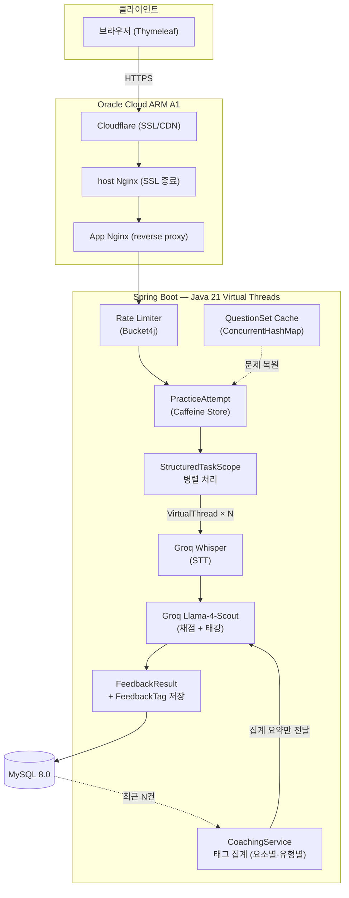

<div align="center">

# OPIcnic

**OPIc 전용 AI 피드백 서비스** — OPIc은 ACTFL 채점 기준을 따르는 시험이라 범용 영어 첨삭으로는 안 맞습니다. OPIcnic은 실제 시험 콤보 규칙으로 문제를 내고, OPIc 전용 루브릭으로 채점해 문항별 개별 피드백과, 여러 답변에 걸친 반복 습관을 잡아내는 코칭 리포트를 제공합니다.

[](https://openjdk.org/projects/loom/)
[](https://spring.io/projects/spring-boot)
[](https://groq.com)
[](https://opicnic.xyz)

[**라이브 데모 →**](https://opicnic.xyz)

<!--
  히어로 GIF: 녹음 → 제출 → 피드백 확인까지 실제 사용 흐름 (10~15초 분량 권장, 1MB 안팎으로 압축)
  파일을 docs/screenshots/hero-demo.gif로 넣으면 아래 이미지가 바로 뜸.
-->


</div>

---

## 프로젝트 개요

OPIc은 정해진 콤보 규칙대로 문제 세트가 구성되고 ACTFL 루브릭으로 채점되는 시험입니다. 그런데 수험생이 실제로 힘들어하는 지점은 채점 자체보다 "무엇을, 어떤 순서로 공부해야 하는지"를 매번 스스로 판단하는 과정입니다 — 내 실력에 맞는 주제인지, 오늘은 뭘 풀어야 하는지, 어떤 유형을 자꾸 피하고 있는지를 계속 혼자 분석해야 합니다.

OPIcnic은 이 판단을 대신 떠맡습니다. 온보딩에서 받은 배경설문으로 난이도·주제 범위를 정하고, 실제 시험처럼 문항이 정해진 조합(콤보) 규칙에 따라 묶여 나오도록 문제를 출제합니다. 접속할 때마다 오늘 풀어야 할 콤보와 이번 주 과제를 알려주고, 특정 유형을 얼마나 회피하고 있는지도 자동으로 감지합니다. 답변마다 OPIc 전용 루브릭으로 즉시 피드백을 주고, 누적된 답변에서 반복되는 취약 유형은 코칭 리포트로 짚어주며, 시험일까지 남은 기간을 기준으로 학습 계획을 역산합니다. 수험생은 "무엇을 공부할지" 고민하는 대신, 앱이 매번 짜준 경로를 따라가기만 하면 됩니다.

---

## 주요 화면

<!-- 각 셀에 docs/screenshots/ 아래 해당 파일명으로 스크린샷 넣으면 됨 -->
<table>
<tr>
<td width="50%" align="center">

<br><sub>온보딩 — 배경설문</sub>
</td>
<td width="50%" align="center">

<br><sub>연습 — 문제 풀이 · 녹음</sub>
</td>
</tr>
<tr>
<td width="50%" align="center">

<br><sub>개별 피드백 리포트</sub>
</td>
<td width="50%" align="center">

<br><sub>코칭 리포트</sub>
</td>
</tr>
</table>

---

## 핵심 성능 지표

<table>
<tr>
<td align="center">
<strong>+580%</strong><br>
<sub>처리량 (Mock, 500VU)<br>96 RPS → 652 RPS</sub>
</td>
<td align="center">
<strong>77%↓</strong><br>
<sub>평균 지연 단축<br>1,100ms → 249ms</sub>
</td>
<td align="center">
<strong>2.7×</strong><br>
<sub>콤보 병렬 처리 (실음성 측정)<br>12,886ms → 4,719ms</sub>
</td>
<td align="center">
<strong>20.5s → 3.73s</strong><br>
<sub>커넥션 경합 해소 (Mock, 500VU)<br>인메모리 캐시 적용</sub>
</td>
</tr>
</table>

---

## 요청 처리 흐름


```mermaid
flowchart LR
    A(["음성 답변 녹음"]) --> B["제출"]
    B --> C["음성 인식 + AI 채점"]
    C --> D["항목별 피드백 리포트"]
    D -.->|"연습 누적 후"| E["코칭 리포트 요청"]
    E --> F["최근 답변 경향 분석"]
```

---

## 아키텍처


```mermaid
graph TB
    subgraph Client["클라이언트"]
        Browser["브라우저 (Thymeleaf)"]
    end

    subgraph Infra["Oracle Cloud ARM A1"]
        CF["Cloudflare (SSL/CDN)"]
        HostNginx["host Nginx (SSL 종료)"]
        AppNginx["App Nginx (reverse proxy)"]
    end

    subgraph App["Spring Boot — Java 21 Virtual Threads"]
        Attempt["PracticeAttempt\n(Caffeine Store)"]
        RateLimit["Rate Limiter\n(Bucket4j)"]
        Cache["QuestionSet Cache\n(ConcurrentHashMap)"]
        SC["StructuredTaskScope\n병렬 처리"]
        STT["Groq Whisper\n(STT)"]
        LLM["Groq Llama-4-Scout\n(채점 + 태깅)"]
        DB["FeedbackResult\n+ FeedbackTag 저장"]
        Coach["CoachingService\n태그 집계 (요소별·유형별)"]
    end

    MySQL[("MySQL 8.0")]

    Browser -->|HTTPS| CF --> HostNginx --> AppNginx
    AppNginx --> RateLimit --> Attempt
    Cache -.->|문제 복원| Attempt
    Attempt --> SC
    SC -->|VirtualThread × N| STT --> LLM --> DB --> MySQL
    MySQL -.->|최근 N건| Coach -->|집계 요약만 전달| LLM
```

---

## 주요 문제 해결

- **디스크 I/O 병목 제거**: DB pool 확장·VT pinning 가설을 1KB 격리 실험과 JFR로 기각/특정한 뒤 톰캣 멀티파트 임시파일 쓰기가 원인임을 확인, InputStream 직접 릴레이로 전환 — RPS 96→652(+580%), Avg Latency 1,100ms→249ms(77%↓)

  <details>
  <summary>InputStream 릴레이 전후 구조</summary>

  ```mermaid
  flowchart LR
      subgraph BEFORE["BEFORE — Heap Copy"]
          direction LR
          b1(["Request"]) --> b2["Tomcat"] --> b3["getBytes()\nbyte[] 1MB 힙 적재"] --> b4["ByteArrayResource"] --> b5["STT API"]
      end
      subgraph AFTER["AFTER — InputStream Relay"]
          direction LR
          a1(["Request"]) --> a2["Tomcat"] -->|"InputStream relay"| a3["STT API"]
      end
      BEFORE -.->|"Avg 1,100ms → 249ms · RPS 96 → 652"| AFTER
  ```

  </details>
- **외부 API 장애 대응**: 외부 STT/LLM 일시 장애로 인한 녹음 유실을, 서버 지수 백오프 3회 재시도 + 실패 문항만 재전송하는 구조로 방지 (문제 본문은 서버가 통제해 재전송 시에도 LLM 입력을 신뢰)
- **커넥션 경합 해소**: 재시도/재전송 구조 도입 이후, 답변 채점마다 대상 문항을 DB에서 다시 조회하는 경로가 500 VU 부하에서 커넥션 경합을 일으켜, 인메모리 캐시를 적용해 제출 p95 20.5s → 3.73s 개선
- **Java 21 Structured Concurrency 병렬 처리**: OPIc 콤보 2~3문항을 순차 채점 시 STT·LLM 외부 대기가 문항 수만큼 누적되어, `StructuredTaskScope`로 문항 간 병렬화(실패 시 나머지 취소)해 순차 예상 12,886ms → 병렬 실측 4,719ms 단축 (2.7배)
- **코칭 리포트 역할 분리**: 코칭 리포트가 "오류가 거의 없는데 시제·어휘가 적절하지 않다"처럼 앞뒤 안 맞는 진단을 내는 문제가 발생. '패턴 카운팅'을 LLM에 통째로 맡긴 게 비결정론적 클러스터링이었기 때문임을 확인하고, 답변 단위 판단(LLM)과 집계·문턱값·그룹핑(결정론적 코드)으로 역할 분리해 해결
- **개인화 추천**: 시험일·학습 이력 기반 일일 연습 목표 역산, 약점·회피 유형 자동 감지로 연습 대상 추천

---

## 기술 스택

| | |
|---|---|
| **Language / Runtime** | Java 21, Virtual Threads |
| **Framework** | Spring Boot 3.4, Spring AI, Spring Security OAuth2 |
| **AI / STT** | Groq Whisper (STT), Groq Llama-4-Scout-17B (LLM) |
| **Database** | MySQL 8.0, Spring Data JPA |
| **Cache** | Caffeine (세션), ConcurrentHashMap (QuestionSet) |
| **Rate Limiting** | Bucket4j (사용자별 10회/시간) |
| **Infra** | Oracle Cloud ARM A1, Docker Compose, Cloudflare SSL |
| **Monitoring** | Prometheus, Grafana, Spring Actuator |

---

## 실행

```bash
cp .env.example .env          # DB_USERNAME/DB_PASSWORD/GRAFANA_PASSWORD/GROQ_API_KEY 채우기
docker-compose up -d          # MySQL
set -a && source .env && set +a
./gradlew bootRun
```

`spring.ai.openai.enabled=false` 설정 시 외부 API 없이 Mock 응답으로 동작합니다.

## 배포

```bash
cp .env.example .env
./deploy.sh
```

`Cloudflare → host Nginx (SSL 종료) → App Nginx → Spring Boot` 구조로 동일 VM에 여러 서비스를 운영합니다.
