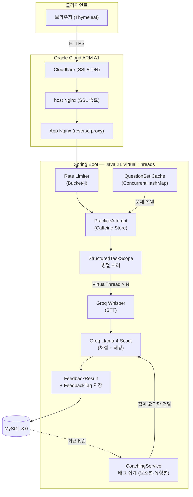

<div align="center">

# Opicnic

**OPIc AI 피드백 서비스** — 음성 답변을 제출하면 LLM이 항목별 피드백 리포트를 생성합니다

[](https://openjdk.org/projects/loom/)
[](https://spring.io/projects/spring-boot)
[](https://groq.com)
[](https://opicnic.xyz)

[**라이브 데모 →**](https://opicnic.xyz)

</div>

---

## 핵심 성능 지표

<table>
<tr>
<td align="center">
<strong>79%</strong><br>
<sub>p95 지연 단축<br>1,130ms → 238ms</sub>
</td>
<td align="center">
<strong>3.3×</strong><br>
<sub>병렬 처리 속도<br>4,877ms → 1,474ms</sub>
</td>
<td align="center">
<strong>2.5×</strong><br>
<sub>처리량 향상<br>96 RPS → 242 RPS</sub>
</td>
<td align="center">
<strong>45개</strong><br>
<sub>배경설문 22 + 돌발 23<br>C1~C5 콤보 패턴</sub>
</td>
</tr>
</table>

---

## 어떻게 동작하나

```
사용자 음성 녹음
      ↓
  attemptId 검증 (서버가 문제 원본 보관, 클라이언트 조작 차단)
      ↓
  N개 질문 ── VirtualThread #1 ──→ Groq STT ──→ Groq LLM(채점) ──→ Groq LLM(태깅) ──→ 피드백
             ── VirtualThread #2 ──→ Groq STT ──→ Groq LLM(채점) ──→ Groq LLM(태깅) ──→ 피드백  (동시)
             ── VirtualThread #3 ──→ Groq STT ──→ Groq LLM(채점) ──→ Groq LLM(태깅) ──→ 피드백
      ↓
  항목별 피드백 리포트 (표현력·정확성·유창성·내용·메인포인트·종합) + FeedbackTag 저장
      ↓
  FeedbackResult DB 저장 (questionType, comboCategory, surveyTopicName 포함)
      ↓
  (별도 요청) CoachingService가 최근 태그를 요소별·유형별로 집계
      ↓
  Groq LLM이 집계된 요약만 문장으로 서술 → 코칭 리포트
```

---

## 아키텍처


```mermaid
graph TB
    subgraph Client["클라이언트"]
        Browser["브라우저 (Thymeleaf)"]
    end

    subgraph Infra["Oracle Cloud ARM A1"]
        CF["Cloudflare (SSL/CDN)"]
        HostNginx["host Nginx (SSL 종료)"]
        AppNginx["App Nginx (reverse proxy)"]
    end

    subgraph App["Spring Boot — Java 21 Virtual Threads"]
        Attempt["PracticeAttempt\n(Caffeine Store)"]
        RateLimit["Rate Limiter\n(Bucket4j)"]
        Cache["QuestionSet Cache\n(ConcurrentHashMap)"]
        SC["StructuredTaskScope\n병렬 처리"]
        STT["Groq Whisper\n(STT)"]
        LLM["Groq Llama-4-Scout\n(채점 + 태깅)"]
        DB["FeedbackResult\n+ FeedbackTag 저장"]
        Coach["CoachingService\n태그 집계 (요소별·유형별)"]
    end

    MySQL[("MySQL 8.0")]

    Browser -->|HTTPS| CF --> HostNginx --> AppNginx
    AppNginx --> RateLimit --> Attempt
    Cache -.->|문제 복원| Attempt
    Attempt --> SC
    SC -->|VirtualThread × N| STT --> LLM --> DB --> MySQL
    MySQL -.->|최근 N건| Coach -->|집계 요약만 전달| LLM
```

---

## 엔지니어링 하이라이트

- **디스크 I/O 병목 제거**: JFR 프로파일링으로 톰캣 멀티파트 임시파일 쓰기를 원인으로 특정, InputStream 직접 릴레이로 전환 — p95 **1,130ms → 238ms** (79%↓)
- **Java 21 Structured Concurrency 병렬 처리**: `StructuredTaskScope.ShutdownOnFailure`로 콤보 내 N개 질문의 STT+LLM 동시 처리, 실패 문항만 `failedIndexes`로 분리 반환 — **4,877ms → 1,474ms** (3.3배)
- **PracticeAttempt 세션 설계**: `attemptId` 기반 서버 측 문제 원본 보관으로 클라이언트 조작 차단, 실패 문항만 재전송하는 재시도 구조로 전체 재녹음 회피
- **OPIc 콤보 패턴 도메인 모델링**: 공식 콤보 I~V를 `ComboPattern` record로 모델링, TYPE_6/7 포함 여부로 C3를 C2보다 먼저 판별하는 우선순위 로직
- **코칭 리포트 태그 기반 재설계**: LLM이 카운팅과 의미 클러스터링을 동시에 수행하며 생기던 자기모순 리포트를, 답변 단위 태깅(LLM)과 다답변 집계·문턱값 필터링(코드)으로 역할 분리 — 패턴추출 호출 1,254토큰 소멸, 리포트 작성 1,726→539~1,300토큰. 같은 재시도 루프에 Groq 429 분리 백오프 + 명시적 타임아웃 포함
- **커넥션 풀 고갈 진단**: 캐싱 후에도 지연이 안 줄자 Grafana/HikariCP `acquire` 지표로 캐싱 가설을 기각하고, SQL 없는 요청에서도 커넥션을 선점하던 `@Transactional(readOnly=true)` 프록시를 특정·제거 — start p95 **16.69s → 20ms** (Mock 기준)

---

## 기술 스택

| | |
|---|---|
| **Language / Runtime** | Java 21, Virtual Threads |
| **Framework** | Spring Boot 3.4, Spring AI, Spring Security OAuth2 |
| **AI / STT** | Groq Whisper (STT), Groq Llama-4-Scout-17B (LLM) |
| **Database** | MySQL 8.0, Spring Data JPA |
| **Cache** | Caffeine (세션), ConcurrentHashMap (QuestionSet) |
| **Rate Limiting** | Bucket4j (사용자별 10회/시간) |
| **Infra** | Oracle Cloud ARM A1, Docker Compose, Cloudflare SSL |
| **Monitoring** | Prometheus, Grafana, Spring Actuator |

---

## 실행

```bash
docker-compose up -d          # MySQL
export GROQ_API_KEY=...
./gradlew bootRun
```

`spring.ai.openai.enabled=false` 설정 시 외부 API 없이 Mock 응답으로 동작합니다.

## 배포

```bash
cp .env.example .env
./deploy.sh
```

`Cloudflare → host Nginx (SSL 종료) → App Nginx → Spring Boot` 구조로 동일 VM에 여러 서비스를 운영합니다.
