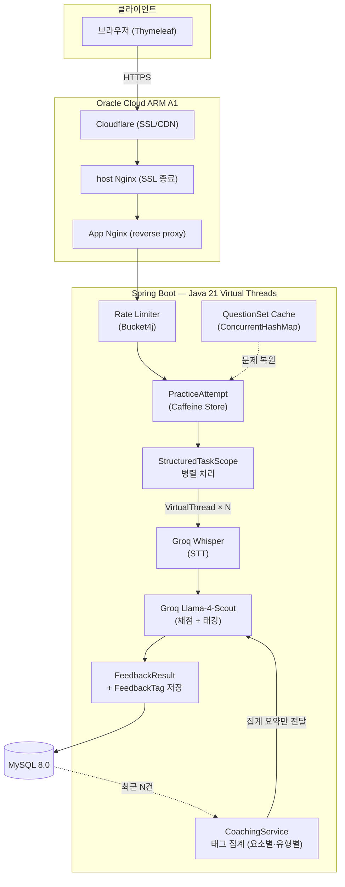

<div align="center">

# Opicnic

**OPIc 전용 AI 피드백 서비스** — OPIc은 ACTFL 채점 기준을 따르는 시험이라 범용 영어 첨삭으로는 안 맞습니다. OPICnic은 실제 시험 콤보 규칙으로 문제를 내고, OPIc 전용 루브릭으로 채점해 문항별 개별 피드백과, 여러 답변에 걸친 반복 습관을 잡아내는 코칭 리포트를 제공합니다.

[](https://openjdk.org/projects/loom/)
[](https://spring.io/projects/spring-boot)
[](https://groq.com)
[](https://opicnic.xyz)

[**라이브 데모 →**](https://opicnic.xyz)

<!--
  히어로 GIF: 녹음 → 제출 → 피드백 확인까지 실제 사용 흐름 (10~15초 분량 권장, 1MB 안팎으로 압축)
  파일을 docs/screenshots/hero-demo.gif로 넣으면 아래 이미지가 바로 뜸.
-->


</div>

---

## 주요 화면

<!-- 각 셀에 docs/screenshots/ 아래 해당 파일명으로 스크린샷 넣으면 됨 -->
<table>
<tr>
<td width="50%" align="center">

<br><sub>온보딩 — 배경설문</sub>
</td>
<td width="50%" align="center">

<br><sub>연습 — 문제 풀이 · 녹음</sub>
</td>
</tr>
<tr>
<td width="50%" align="center">

<br><sub>개별 피드백 리포트</sub>
</td>
<td width="50%" align="center">

<br><sub>코칭 리포트</sub>
</td>
</tr>
</table>

---

## 핵심 성능 지표

<table>
<tr>
<td align="center">
<strong>+580%</strong><br>
<sub>처리량 (Mock, 500VU)<br>96 RPS → 652 RPS</sub>
</td>
<td align="center">
<strong>77%↓</strong><br>
<sub>평균 지연 단축<br>1,100ms → 249ms</sub>
</td>
<td align="center">
<strong>2.7×</strong><br>
<sub>콤보 병렬 처리 (실음성 측정)<br>12,886ms → 4,719ms</sub>
</td>
<td align="center">
<strong>16.69s → 20ms</strong><br>
<sub>커넥션풀 경쟁 해소 (Mock, 500VU)<br>readOnly 프록시 제거</sub>
</td>
</tr>
</table>

---

## 요청 처리 흐름


```mermaid
flowchart LR
    A(["음성 답변 녹음"]) --> B["제출"]
    B --> C["음성 인식 + AI 채점"]
    C --> D["항목별 피드백 리포트"]
    D -.->|"연습 누적 후"| E["코칭 리포트 요청"]
    E --> F["최근 답변 경향 분석"]
```

---

## 아키텍처


```mermaid
graph TB
    subgraph Client["클라이언트"]
        Browser["브라우저 (Thymeleaf)"]
    end

    subgraph Infra["Oracle Cloud ARM A1"]
        CF["Cloudflare (SSL/CDN)"]
        HostNginx["host Nginx (SSL 종료)"]
        AppNginx["App Nginx (reverse proxy)"]
    end

    subgraph App["Spring Boot — Java 21 Virtual Threads"]
        Attempt["PracticeAttempt\n(Caffeine Store)"]
        RateLimit["Rate Limiter\n(Bucket4j)"]
        Cache["QuestionSet Cache\n(ConcurrentHashMap)"]
        SC["StructuredTaskScope\n병렬 처리"]
        STT["Groq Whisper\n(STT)"]
        LLM["Groq Llama-4-Scout\n(채점 + 태깅)"]
        DB["FeedbackResult\n+ FeedbackTag 저장"]
        Coach["CoachingService\n태그 집계 (요소별·유형별)"]
    end

    MySQL[("MySQL 8.0")]

    Browser -->|HTTPS| CF --> HostNginx --> AppNginx
    AppNginx --> RateLimit --> Attempt
    Cache -.->|문제 복원| Attempt
    Attempt --> SC
    SC -->|VirtualThread × N| STT --> LLM --> DB --> MySQL
    MySQL -.->|최근 N건| Coach -->|집계 요약만 전달| LLM
```

---

## 엔지니어링 하이라이트

- **디스크 I/O 병목 제거**: DB pool 확장·VT pinning 가설을 1KB 격리 실험과 JFR로 기각/특정한 뒤 톰캣 멀티파트 임시파일 쓰기가 원인임을 확인, InputStream 직접 릴레이로 전환 — RPS 96→652(+580%), Avg Latency 1,100ms→249ms(77%↓)

  <details>
  <summary>InputStream 릴레이 전후 구조</summary>

  ```mermaid
  flowchart LR
      subgraph BEFORE["BEFORE — Heap Copy"]
          direction LR
          b1(["Request"]) --> b2["Tomcat"] --> b3["getBytes()\nbyte[] 1MB 힙 적재"] --> b4["ByteArrayResource"] --> b5["STT API"]
      end
      subgraph AFTER["AFTER — InputStream Relay"]
          direction LR
          a1(["Request"]) --> a2["Tomcat"] -->|"InputStream relay"| a3["STT API"]
      end
      BEFORE -.->|"Avg 1,100ms → 249ms · RPS 96 → 652"| AFTER
  ```

  </details>
- **Java 21 Structured Concurrency 병렬 처리**: `StructuredTaskScope.ShutdownOnFailure`로 콤보 내 N개 질문의 STT+LLM 동시 처리, 실패 문항만 `failedIndexes`로 분리 반환 — 실제 음성(1분20초, 3문항) 기준 **12,886ms → 4,719ms** (2.7배)
- **PracticeAttempt 세션 설계**: `attemptId` 기반 서버 측 문제 원본 보관으로 클라이언트 조작 차단, 실패 문항만 재전송하는 재시도 구조로 전체 재녹음 회피
- **OPIc 콤보 패턴 도메인 모델링**: 공식 콤보 I~V를 `ComboPattern` record로 모델링, TYPE_6/7 포함 여부로 C3를 C2보다 먼저 판별하는 우선순위 로직
- **코칭 리포트 태그 기반 재설계**: LLM이 카운팅과 의미 클러스터링을 동시에 수행하며 생기던 자기모순 리포트를, 답변 단위 태깅(LLM)과 다답변 집계·문턱값 필터링(코드)으로 역할 분리 — 패턴추출 호출 1,254토큰 소멸, 리포트 작성 1,726→539~1,300토큰. 같은 재시도 루프에 Groq 429 분리 백오프 + 명시적 타임아웃 포함
- **커넥션 풀 고갈 진단**: 캐싱 후에도 지연이 안 줄자 Grafana/HikariCP `acquire` 지표로 캐싱 가설을 기각하고, SQL 없는 요청에서도 커넥션을 선점하던 `@Transactional(readOnly=true)` 프록시를 특정·제거 — start p95 **16.69s → 20ms** (Mock 기준)

---

## 기술 스택

| | |
|---|---|
| **Language / Runtime** | Java 21, Virtual Threads |
| **Framework** | Spring Boot 3.4, Spring AI, Spring Security OAuth2 |
| **AI / STT** | Groq Whisper (STT), Groq Llama-4-Scout-17B (LLM) |
| **Database** | MySQL 8.0, Spring Data JPA |
| **Cache** | Caffeine (세션), ConcurrentHashMap (QuestionSet) |
| **Rate Limiting** | Bucket4j (사용자별 10회/시간) |
| **Infra** | Oracle Cloud ARM A1, Docker Compose, Cloudflare SSL |
| **Monitoring** | Prometheus, Grafana, Spring Actuator |

---

## 실행

```bash
cp .env.example .env          # DB_USERNAME/DB_PASSWORD/GRAFANA_PASSWORD/GROQ_API_KEY 채우기
docker-compose up -d          # MySQL
set -a && source .env && set +a
./gradlew bootRun
```

`spring.ai.openai.enabled=false` 설정 시 외부 API 없이 Mock 응답으로 동작합니다.

## 배포

```bash
cp .env.example .env
./deploy.sh
```

`Cloudflare → host Nginx (SSL 종료) → App Nginx → Spring Boot` 구조로 동일 VM에 여러 서비스를 운영합니다.
