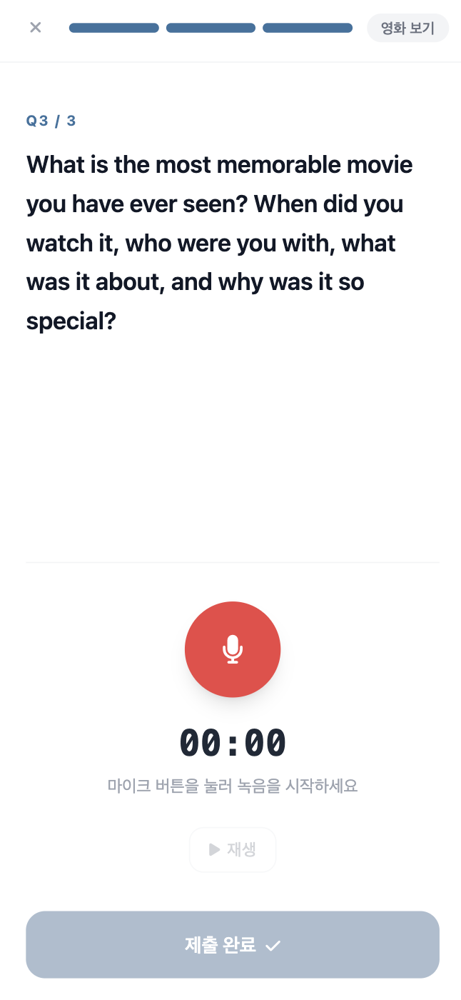

<div align="center">

# OPIcnic

**OPIc 전용 AI 피드백 서비스** — OPIc은 ACTFL 채점 기준을 따르는 시험이라 범용 영어 첨삭으로는 안 맞습니다. OPIcnic은 실제 시험 콤보 규칙으로 문제를 내고, OPIc 전용 루브릭으로 채점해 문항별 개별 피드백과, 여러 답변에 걸친 반복 습관을 잡아내는 코칭 리포트를 제공합니다.

[](https://openjdk.org/projects/loom/)
[](https://spring.io/projects/spring-boot)
[](https://groq.com)
[](https://opicnic.xyz)

[**라이브 데모 →**](https://opicnic.xyz)


</div>

---

**목차**

- [프로젝트 개요](#프로젝트-개요)
- [주요 화면](#주요-화면)
- [핵심 성능 지표](#핵심-성능-지표)
- [요청 처리 흐름](#요청-처리-흐름)
- [아키텍처](#아키텍처)
- [주요 문제 해결](#주요-문제-해결)
- [기술 스택](#기술-스택)
- [실행](#실행)
- [배포](#배포)

---

## 프로젝트 개요

> OPIc은 정해진 콤보 규칙대로 문제 세트가 구성되고 ACTFL 루브릭으로 채점되는 시험입니다. 그런데 수험생이 실제로 힘들어하는 지점은 채점 자체보다, **"무엇을, 어떤 순서로 공부해야 하는지"를 매번 스스로 판단하는 과정**입니다.

OPIcnic은 이 판단을 대신 떠맡습니다.

주제 선택부터 맞춤 문제 · 맞춤 피드백 · 맞춤 코칭 · 학습 계획까지, 학습 사이클 전체를 앱이 대신 판단해줍니다.

| 수험생이 매번 고민하던 것 | OPIcnic이 대신 해주는 것 |
|---|---|
| 어떤 주제부터 골라야 할지 모르겠음 | 고득점에 불리한 선택지(직업 관련 주제 등)는 온보딩에서 아예 제외 — 남은 것 중에서만 고르면 됨 |
| 문제가 실제 시험이랑 다르게 나오면 연습한 보람이 없음 | 실제 시험 콤보 규칙 그대로 재현해 출제 |
| 오늘 뭘, 얼마나 풀어야 하는지 매번 판단해야 함 | 콤보 진행률·이번 주 과제·오래 방치한 유형까지 오늘 할 일 화면 하나로 안내 |
| 이 답변이 시험 기준으로 괜찮은 건가 | OPIc 전용 루브릭으로 답변마다 즉시 피드백 |
| 반복되는 약점을 스스로 못 찾겠음 | 누적된 답변에서 패턴을 잡아내는 코칭 리포트 |
| 시험 전까지 뭘 언제 해야 하지 | 시험일까지 남은 기간 기준으로 학습 계획 역산 |

수험생은 "무엇을 공부할지" 고민하는 대신, 앱이 매번 짜준 경로를 따라가기만 하면 됩니다.

---

## 주요 화면

**1. 온보딩 — 배경설문**
<br>고득점에 불리한 선택지는 처음부터 제외하고, 남은 것 중에서만 고르면 됩니다.


**2. 연습 — 문제 풀이 · 녹음**
<br>실제 시험 콤보 규칙 그대로 재현된 문제로 연습합니다.


**3. 코칭 리포트**
<br>누적된 답변에서 반복되는 패턴을 잡아냅니다.


---

## 핵심 성능 지표

<table>
<tr>
<td align="center">
<strong>+580%</strong><br>
<sub>처리량 (Mock, 500VU)<br>96 RPS → 652 RPS</sub>
</td>
<td align="center">
<strong>77%↓</strong><br>
<sub>평균 지연 단축<br>1,100ms → 249ms</sub>
</td>
<td align="center">
<strong>2.7×</strong><br>
<sub>콤보 병렬 처리 (실음성 측정)<br>12,886ms → 4,719ms</sub>
</td>
<td align="center">
<strong>20.5s → 3.73s</strong><br>
<sub>커넥션 경합 해소 (Mock, 500VU)<br>인메모리 캐시 적용</sub>
</td>
</tr>
</table>

---

## 요청 처리 흐름


```mermaid
flowchart LR
    A(["음성 답변 녹음"]) --> B["제출"]
    B --> C["음성 인식 + AI 채점"]
    C --> D["항목별 피드백 리포트"]
    D -.->|"연습 누적 후"| E["코칭 리포트 요청"]
    E --> F["최근 답변 경향 분석"]
```

---

## 아키텍처


```mermaid
graph LR
    subgraph Client["클라이언트"]
        Browser["브라우저 (Thymeleaf)"]
    end

    subgraph Infra["Oracle Cloud ARM A1"]
        CF["Cloudflare (SSL/CDN)"]
        HostNginx["host Nginx (SSL 종료)"]
        AppNginx["App Nginx (reverse proxy)"]
    end

    subgraph App["Spring Boot — Java 21 Virtual Threads"]
        Attempt["PracticeAttempt\n(Caffeine Store)"]
        RateLimit["Rate Limiter\n(Bucket4j)"]
        Cache["QuestionSet Cache\n(ConcurrentHashMap)"]
        SC["StructuredTaskScope\n병렬 처리"]
        STT["Groq Whisper\n(STT)"]
        LLM["Groq Llama-3.3-70B\n(채점 + 태깅)"]
        DB["FeedbackResult\n+ FeedbackTag 저장"]
        Coach["CoachingService\n태그 집계 (요소별·유형별)"]
        CoachLLM["Groq Llama-3.3-70B\n(코칭 리포트 작성)"]
    end

    MySQL[("MySQL 8.0")]

    Browser -->|HTTPS| CF --> HostNginx --> AppNginx
    AppNginx --> RateLimit --> Attempt
    Cache -.->|문제 복원| Attempt
    Attempt --> SC
    SC -->|VirtualThread × N| STT --> LLM --> DB --> MySQL
    MySQL -.->|최근 N건| Coach -->|집계 요약만 전달| CoachLLM

    classDef client fill:#f3f4f6,stroke:#9ca3af,color:#111827
    classDef infra fill:#ecfeff,stroke:#0891b2,color:#164e63
    classDef app fill:#fff7ed,stroke:#ED8B00,color:#7c2d12
    classDef groq fill:#f3e8ff,stroke:#412991,color:#412991
    classDef db fill:#eff6ff,stroke:#2563eb,color:#1e3a5f

    class Browser client
    class CF,HostNginx,AppNginx infra
    class Attempt,RateLimit,Cache,SC,DB,Coach app
    class STT,LLM,CoachLLM groq
    class MySQL db
```

---

## 주요 문제 해결

- **디스크 I/O 병목 제거**: DB pool 확장·VT pinning 가설을 1KB 격리 실험과 JFR로 기각/특정한 뒤 톰캣 멀티파트 임시파일 쓰기가 원인임을 확인, InputStream 직접 릴레이로 전환 — **RPS 96→652(+580%), Avg Latency 1,100ms→249ms(77%↓)**

  <details>
  <summary>InputStream 릴레이 전후 구조</summary>

  ```mermaid
  flowchart LR
      subgraph BEFORE["BEFORE — Heap Copy"]
          direction LR
          b1(["Request"]) --> b2["Tomcat"] --> b3["getBytes()\nbyte[] 1MB 힙 적재"] --> b4["ByteArrayResource"] --> b5["STT API"]
      end
      subgraph AFTER["AFTER — InputStream Relay"]
          direction LR
          a1(["Request"]) --> a2["Tomcat"] -->|"InputStream relay"| a3["STT API"]
      end
      BEFORE -.->|"Avg 1,100ms → 249ms · RPS 96 → 652"| AFTER
  ```

  </details>
- **외부 API 장애 대응**: 외부 STT/LLM 일시 장애로 인한 녹음 유실을, 서버 지수 백오프 3회 재시도 + 실패 문항만 재전송하는 구조로 방지 (문제 본문은 서버가 통제해 재전송 시에도 LLM 입력을 신뢰)
- **커넥션 경합 해소**: 재시도/재전송 구조 도입 이후, 답변 채점마다 대상 문항을 DB에서 다시 조회하는 경로가 500 VU 부하에서 커넥션 경합을 일으켜, 인메모리 캐시를 적용해 **제출 p95 20.5s → 3.73s 개선**
- **Java 21 Structured Concurrency 병렬 처리**: OPIc 콤보 2~3문항을 순차 채점 시 STT·LLM 외부 대기가 문항 수만큼 누적되어, `StructuredTaskScope`로 문항 간 병렬화(실패 시 나머지 취소)해 **순차 예상 12,886ms → 병렬 실측 4,719ms 단축 (2.7배)**
- **코칭 리포트 역할 분리**: 코칭 리포트가 "오류가 거의 없는데 시제·어휘가 적절하지 않다"처럼 앞뒤 안 맞는 진단을 내는 문제가 발생. '패턴 카운팅'을 LLM에 통째로 맡긴 게 비결정론적 클러스터링이었기 때문임을 확인하고, 답변 단위 판단(LLM)과 집계·문턱값·그룹핑(결정론적 코드)으로 역할 분리해 해결
- **개인화 추천**: 시험일·학습 이력 기반 일일 연습 목표 역산, 오래 연습 안 한 유형·약점 유형을 자동으로 짚어 연습 대상 추천

---

## 기술 스택

| | |
|---|---|
| **Language / Runtime** | Java 21, Virtual Threads |
| **Framework** | Spring Boot 3.4, Spring AI, Spring Security OAuth2 |
| **AI / STT** | Groq Whisper (STT), Groq Llama-3.3-70B-Versatile (채점/태깅) |
| **Database** | MySQL 8.0, Spring Data JPA |
| **Cache** | Caffeine (세션), ConcurrentHashMap (QuestionSet) |
| **Rate Limiting** | Bucket4j (사용자별 10회/시간) |
| **Infra** | Oracle Cloud ARM A1, Docker Compose, Cloudflare SSL |
| **Monitoring** | Prometheus, Grafana, Spring Actuator |

---

## 실행

```bash
cp .env.example .env          # DB_USERNAME/DB_PASSWORD/GRAFANA_PASSWORD/GROQ_API_KEY 채우기
docker-compose up -d          # MySQL
set -a && source .env && set +a
./gradlew bootRun
```

`spring.ai.openai.enabled=false` 설정 시 외부 API 없이 Mock 응답으로 동작합니다.

## 배포

```bash
cp .env.example .env
./deploy.sh
```

`Cloudflare → host Nginx (SSL 종료) → App Nginx → Spring Boot` 구조로 동일 VM에 여러 서비스를 운영합니다.
