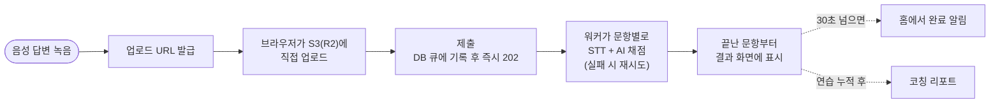
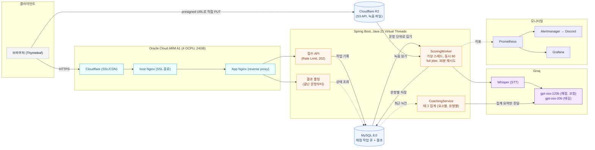

<div align="center">

# OPIcnic

**OPIc 전용 AI 피드백 서비스** — OPIc은 ACTFL 채점 기준을 따르는 시험이라 범용 영어 첨삭으로는 안 맞습니다. OPIcnic은 실제 시험 콤보 규칙으로 문제를 내고, OPIc 전용 루브릭으로 채점해 문항별 개별 피드백과, 여러 답변에 걸친 반복 습관을 잡아내는 코칭 리포트를 제공합니다.

[](https://openjdk.org/projects/loom/)
[](https://spring.io/projects/spring-boot)
[](https://groq.com)
[](https://opicnic.xyz)

[**라이브 데모 →**](https://opicnic.xyz)


</div>

---

**목차**

- [프로젝트 개요](#프로젝트-개요)
- [주요 화면](#주요-화면)
- [핵심 성능 지표](#핵심-성능-지표)
- [요청 처리 흐름](#요청-처리-흐름)
- [아키텍처](#아키텍처)
- [주요 문제 해결](#주요-문제-해결)
- [기술 스택](#기술-스택)
- [실행](#실행)
- [배포](#배포)

---

## 프로젝트 개요

> OPIc은 정해진 콤보 규칙대로 문제 세트가 구성되고 ACTFL 루브릭으로 채점되는 시험입니다. 그런데 수험생이 실제로 힘들어하는 지점은 채점 자체보다, **"무엇을, 어떤 순서로 공부해야 하는지"를 매번 스스로 판단하는 과정**입니다.

OPIcnic은 이 판단을 대신 떠맡습니다.

주제 선택부터 맞춤 문제 · 맞춤 피드백 · 맞춤 코칭 · 학습 계획까지, 학습 사이클 전체를 앱이 대신 판단해줍니다.

| 수험생이 매번 고민하던 것 | OPIcnic이 대신 해주는 것 |
|---|---|
| 어떤 주제부터 골라야 할지 모르겠음 | 고득점에 불리한 선택지(직업 관련 주제 등)는 온보딩에서 아예 제외 — 남은 것 중에서만 고르면 됨 |
| 문제가 실제 시험이랑 다르게 나오면 연습한 보람이 없음 | 실제 시험 콤보 규칙 그대로 재현해 출제 |
| 오늘 뭘, 얼마나 풀어야 하는지 매번 판단해야 함 | 콤보 진행률·이번 주 과제·오래 방치한 유형까지 오늘 할 일 화면 하나로 안내 |
| 이 답변이 시험 기준으로 괜찮은 건가 | OPIc 전용 루브릭으로 답변마다 즉시 피드백 |
| 반복되는 약점을 스스로 못 찾겠음 | 누적된 답변에서 패턴을 잡아내는 코칭 리포트 |
| 시험 전까지 뭘 언제 해야 하지 | 시험일까지 남은 기간 기준으로 학습 계획 역산 |

수험생은 "무엇을 공부할지" 고민하는 대신, 앱이 매번 짜준 경로를 따라가기만 하면 됩니다.

---

## 주요 화면

**1. 온보딩 — 배경설문**
<br>고득점에 불리한 선택지는 처음부터 제외하고, 남은 것 중에서만 고르면 됩니다.


**2. 연습 — 문제 풀이 · 녹음**
<br>실제 시험 콤보 규칙 그대로 재현된 문제로 연습합니다.


**3. 코칭 리포트**
<br>누적된 답변에서 반복되는 패턴을 잡아냅니다.


---

## 핵심 성능 지표

<table>
<tr>
<td align="center">
<strong>100%</strong><br>
<sub>이탈·재시작 시 채점 완료율<br>접수 직후·채점 중 서버 kill 테스트</sub>
</td>
<td align="center">
<strong>22.8% → 0%</strong><br>
<sub>외부 API 45% 장애 시 실패 문항<br>재시도 3회 제한 → 30분 시간 기준</sub>
</td>
<td align="center">
<strong>270s → 54s</strong><br>
<sub>장애 복구 후 채점 완료<br>full jitter 백오프 (mock 60초 장애)</sub>
</td>
<td align="center">
<strong>7.6s → 0.02s</strong><br>
<sub>채점 접수 응답<br>채점 완료를 기다리지 않고 접수만 응답</sub>
</td>
</tr>
</table>

---

## 요청 처리 흐름


```mermaid
flowchart LR
    A(["음성 답변 녹음"]) --> B["업로드 URL 발급"]
    B --> C["브라우저가 S3(R2)에<br>직접 업로드"]
    C --> D["제출<br>DB 큐에 기록 후 즉시 202"]
    D --> E["워커가 문항별로<br>STT + AI 채점<br>(실패 시 재시도)"]
    E --> F["끝난 문항부터<br>결과 화면에 표시"]
    F -.->|"30초 넘으면"| G["홈에서 완료 알림"]
    F -.->|"연습 누적 후"| H["코칭 리포트"]
```

채점은 사용자 요청에서 분리되어 있습니다. 제출하면 바로 접수가 확정되고, 이후 채점과 재시도는 서버 워커가 맡습니다. 화면을 떠나거나 서버가 재시작돼도 녹음 파일(S3)과 채점 작업(DB)이 남아 있어 이어서 처리됩니다.

---

## 아키텍처


```mermaid
graph LR
    subgraph Client["클라이언트"]
        Browser["브라우저 (Thymeleaf)"]
    end

    subgraph Infra["Oracle Cloud ARM A1 (4 OCPU, 24GB)"]
        CF["Cloudflare (SSL/CDN)"]
        HostNginx["host Nginx (SSL 종료)"]
        AppNginx["App Nginx (reverse proxy)"]
    end

    R2[("Cloudflare R2<br>(S3 API, 녹음 파일)")]

    subgraph App["Spring Boot, Java 21 Virtual Threads"]
        Submit["접수 API<br>(Rate Limit, 202)"]
        Worker["ScoringWorker<br>가상 스레드, 동시 60<br>full jitter, 30분 재시도"]
        Poll["결과 폴링<br>(끝난 문항부터)"]
        Coach["CoachingService<br>태그 집계 (요소별, 유형별)"]
    end

    subgraph Groq["Groq"]
        STT["Whisper (STT)"]
        LLM["gpt-oss-120b (채점, 코칭)<br>gpt-oss-20b (태깅)"]
    end

    MySQL[("MySQL 8.0<br>채점 작업 큐 + 결과")]

    subgraph Mon["모니터링"]
        Prom["Prometheus"] --> Alert["Alertmanager → Discord"]
        Prom --> Grafana["Grafana"]
    end

    Browser -->|HTTPS| CF --> HostNginx --> AppNginx
    Browser -->|presigned URL로 직접 PUT| R2
    AppNginx --> Submit -->|작업 기록| MySQL
    MySQL -->|문항 단위로 집기| Worker
    R2 -->|녹음 읽기| Worker
    Worker --> STT --> LLM
    Worker -->|문항별 저장| MySQL
    AppNginx --> Poll -.->|상태 조회| MySQL
    MySQL -.->|최근 N건| Coach -->|집계 요약만 전달| LLM
    Worker -.->|지표| Prom

    classDef client fill:#f3f4f6,stroke:#9ca3af,color:#111827
    classDef infra fill:#ecfeff,stroke:#0891b2,color:#164e63
    classDef app fill:#fff7ed,stroke:#ED8B00,color:#7c2d12
    classDef groq fill:#f3e8ff,stroke:#412991,color:#412991
    classDef db fill:#eff6ff,stroke:#2563eb,color:#1e3a5f

    class Browser client
    class CF,HostNginx,AppNginx infra
    class Submit,Worker,Poll,Coach app
    class STT,LLM groq
    class MySQL,R2 db
```

설계 기준: MAU 24만 가정, 피크 동시 채점 30건 / 접수 응답 p95 0.5s 이내, 이탈 및 재시작 시 채점 완료율 100%, 외부 API 일시 장애 시 실패 문항 0 (`docs/performance/slo.md`)

---

## 주요 문제 해결

- **채점 비동기 전환 (S3 + DB 큐 워커)**: 녹음 파일을 서버 메모리에 올려 요청 안에서 동기로 채점하다 보니, 사용자가 이탈하거나 서버가 재시작되면 채점 결과가 사라지고 외부 API가 실패하면 답변을 다시 녹음해야 했습니다. 녹음 파일은 presigned URL로 S3(R2)에 직접 올리고, 채점 작업은 DB 큐에 기록해 워커가 문항 단위로 처리하도록 분리했습니다. Kafka 대신 DB 큐를 쓴 건 결과 저장과 상태 변경을 한 트랜잭션으로 묶기 위해서이고, 결과는 서버가 연결을 들고 있을 필요가 없는 숏폴링으로 전달합니다 — **이탈·재시작 시 완료율 100%, 접수 응답 7.6s → 0.02s, Humongous GC 5분당 25회 → 3회** (`docs/adr/0001-async-r2.md`)
- **외부 API 장애 대응**: 사용자가 결과를 기다리지 않게 되면서 재시도 한도를 횟수(3회) 대신 접수 후 30분이라는 시간 기준으로 바꿨습니다. 실패는 "기다리면 풀리는가"로 나눠 녹음 파일 문제는 즉시 실패, 429와 5xx, 타임아웃만 재시도합니다. 오래 걸리면 끝난 문항부터 보여주고, 30초가 지나면 홈에서 완료를 알립니다 — **45% 장애 주입 시 실패 문항 22.8% → 0%**
- **재시도 폭주 방지 (full jitter)**: 외부 API가 복구되는 순간 밀린 재시도가 한꺼번에 몰리는 상황을 mock 외부 API(60초 장애 후 복구, 복구 직후 초당 10건 처리)로 재현했습니다. 기존 지수 백오프는 대기가 60초 상한에 붙어 모든 문항이 같은 박자로 몰렸고, 대기 범위만 2배씩 늘리고 실제 대기는 그 안에서 무작위로 고르는 full jitter로 바꿔 분산했습니다 — **복구 후 채점 완료 270s → 54s, 거절된 호출(429) 33% → 0.4%** (`docs/performance/2026-09-26/retry-storm.md`)
- **관측과 알림**: CPU, 힙 같은 기존 지표로는 외부 모델이 사라져 채점이 전부 실패한 장애를 잡지 못했습니다. 외부 호출의 호출 수, 에러, 지연(RED)과 워커 큐를 지표로 만들고, 사용자에게 한 약속이 깨지는 증상(최종 실패 비율, 워커 멈춤, 접수 지연, 완료 시간, 채점 실패율)에 알림 5개를 걸었습니다. 알림 규칙은 promtool 단위 테스트로 검증합니다
- **디스크 I/O 병목 제거**: DB pool 확장·VT pinning 가설을 1KB 격리 실험과 JFR로 기각/특정한 뒤 톰캣 멀티파트 임시파일 쓰기가 원인임을 확인, 멀티파트 임계치를 올려 디스크 쓰기를 제거 — **RPS 96→652, Avg Latency 1,100ms→249ms** (2026-04, Mock STT/LLM, 단일 실행, 동기 구조 시절)

  <details>
  <summary>2026-04 당시 전후 구조 (릴레이는 이후 되돌림)</summary>

  ```mermaid
  flowchart LR
      subgraph BEFORE["BEFORE — Heap Copy"]
          direction LR
          b1(["Request"]) --> b2["Tomcat"] --> b3["getBytes()\nbyte[] 1MB 힙 적재"] --> b4["ByteArrayResource"] --> b5["STT API"]
      end
      subgraph AFTER["AFTER — InputStream Relay"]
          direction LR
          a1(["Request"]) --> a2["Tomcat"] -->|"InputStream relay"| a3["STT API"]
      end
      BEFORE -.->|"Avg 1,100ms → 249ms · RPS 96 → 652"| AFTER
  ```

  4월엔 (1) `file-size-threshold: 2MB`로 톰캣 임시파일 쓰기 제거, (2) `InputStream` 릴레이로 힙 복사 제거 두 개를 같이 넣었다. 6월에 STT/LLM 자동 재시도가 필요해지면서 스트림을 다시 읽을 수 없어 `byte[]` 버퍼링으로 되돌렸고(`docs/local/2026-06-06`), 8월에 타입까지 정리했다. **지금 코드에 남은 건 (1)뿐이다.** 그 힙 적재의 비용은 2026-09 부하테스트에서 GC 압박으로 측정됐고, 오브젝트 스토리지 직접 업로드로 전환하는 근거가 됐다(`docs/adr/0001-async-r2.md`).

  </details>
- **커넥션 경합 해소**: 재시도/재전송 구조 도입 이후, 답변 채점마다 대상 문항을 DB에서 다시 조회하는 경로가 부하 상황에서 커넥션 경합을 일으켰습니다. 인메모리 캐시로 반복 조회를 제거할 기반을 만들고, 캐시 히트에도 커넥션을 선점하던 이전 `@Transactional` 경계를 함께 제거해 DB 조회·커넥션 획득이 없는 경로를 완성하여 **제출 p95 20.5s → 3.73s 개선** (동기 구조 시절)
- **문항 병렬 처리**: OPIc 콤보 2~3문항을 순차 채점하면 STT·LLM 외부 대기가 문항 수만큼 누적되어, 문항별 가상 스레드로 병렬화해 **직렬 12,886ms → 병렬 4,719ms (2.7배, 실음성 측정)**. 동기 구조 시절엔 `StructuredTaskScope`로 한 요청 안의 문항을 묶었고, 지금은 워커가 문항을 각각 독립된 작업으로 처리합니다
- **코칭 리포트 역할 분리**: 코칭 리포트가 "오류가 거의 없는데 시제·어휘가 적절하지 않다"처럼 앞뒤 안 맞는 진단을 내는 문제가 발생. '패턴 카운팅'을 LLM에 통째로 맡긴 게 비결정론적 클러스터링이었기 때문임을 확인하고, 답변 단위 판단(LLM)과 집계·문턱값·그룹핑(결정론적 코드)으로 역할 분리해 해결
- **개인화 추천**: 시험일·학습 이력 기반 일일 연습 목표 역산, 오래 연습 안 한 유형·약점 유형을 자동으로 짚어 연습 대상 추천

---

## 기술 스택

| | |
|---|---|
| **Language / Runtime** | Java 21, Virtual Threads |
| **Framework** | Spring Boot 3.4, Spring AI, Spring Security OAuth2 |
| **AI / STT** | Groq Whisper (STT), Groq gpt-oss-120b (채점/코칭 작성), Groq gpt-oss-20b (태깅) — 모델 ID는 제공자 사정으로 세 번 바뀜, 설정값으로 분리 |
| **Database** | MySQL 8.0, Spring Data JPA (채점 작업 큐 겸용) |
| **Storage** | Cloudflare R2 (S3 API, presigned URL 직접 업로드) |
| **Cache** | Caffeine (제출 전 연습 상태), ConcurrentHashMap (QuestionSet) |
| **Rate Limiting** | Bucket4j (사용자별 시간당 15문항, 검증 통과 후 실제 채점 문항 수만큼 소비) |
| **Infra** | Oracle Cloud ARM A1, Docker Compose, Cloudflare SSL |
| **Monitoring** | Prometheus, Grafana, Alertmanager (Discord), Spring Actuator + Micrometer |

---

## 실행

```bash
cp .env.example .env          # DB_USERNAME/DB_PASSWORD/GRAFANA_PASSWORD/GROQ_API_KEY 채우기
docker-compose up -d          # MySQL
set -a && source .env && set +a
./gradlew bootRun
```

- `STT_ENABLED=false LLM_ENABLED=false`로 실행하면 외부 API 없이 Mock 응답으로 동작합니다.
- R2 키(`R2_*`)가 비어 있으면 인메모리 저장소로 기동합니다(로컬 확인용, 재시작 시 녹음 유실).

## 배포

```bash
cp .env.example .env
./deploy.sh
```

`Cloudflare → host Nginx (SSL 종료) → App Nginx → Spring Boot` 구조로 동일 VM에 여러 서비스를 운영합니다.
