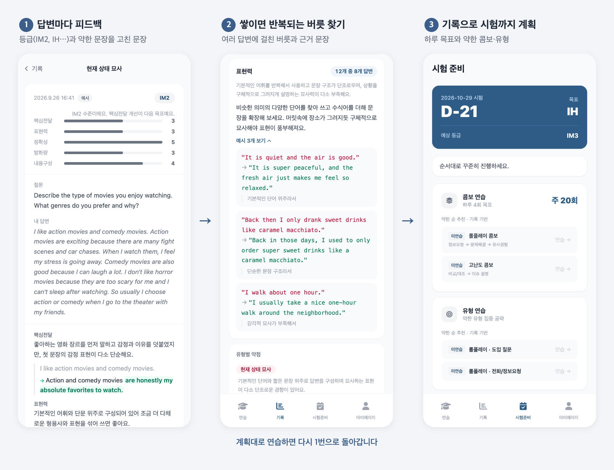
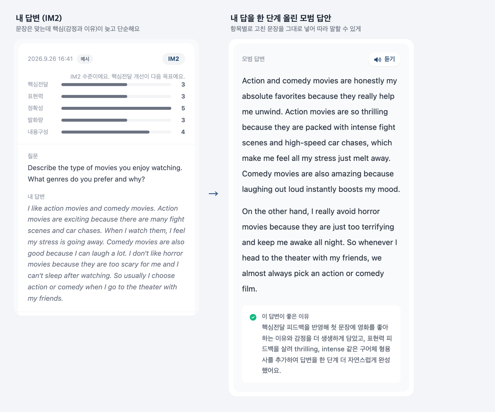
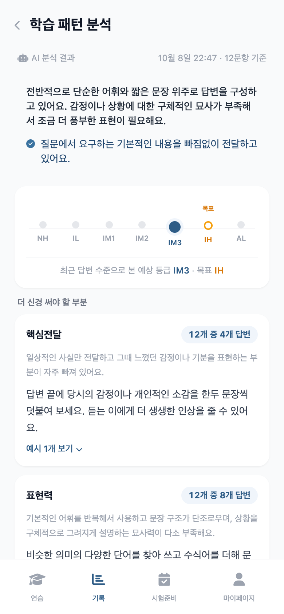
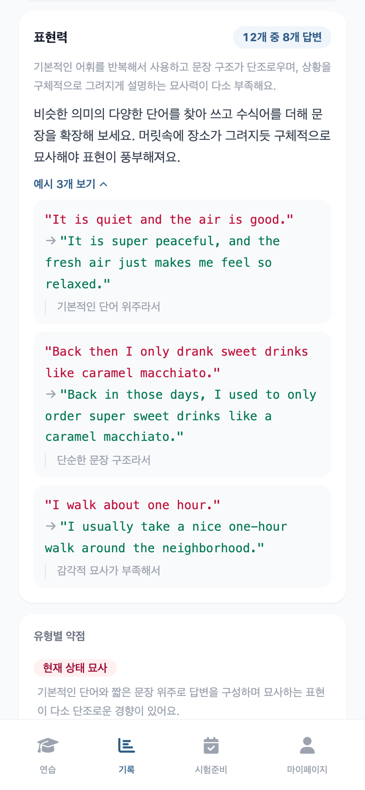
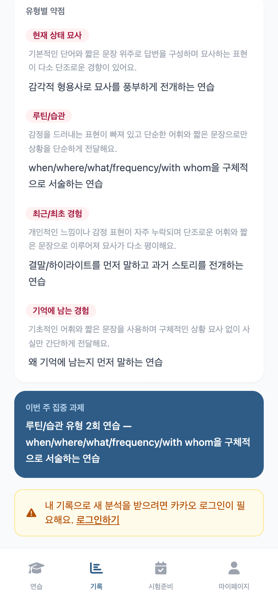
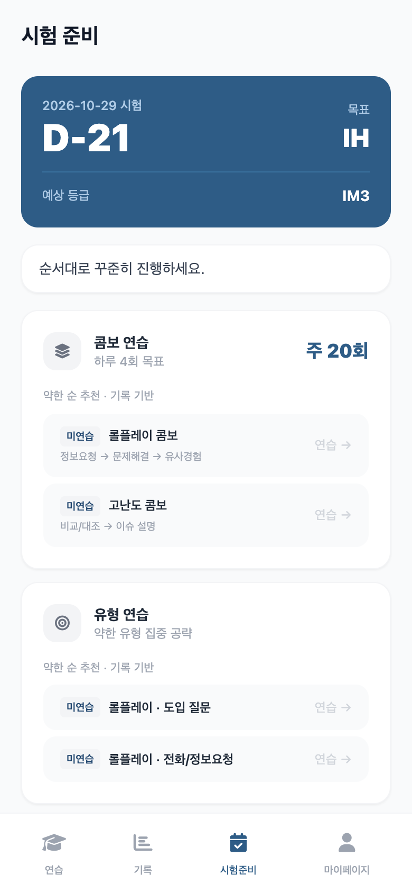
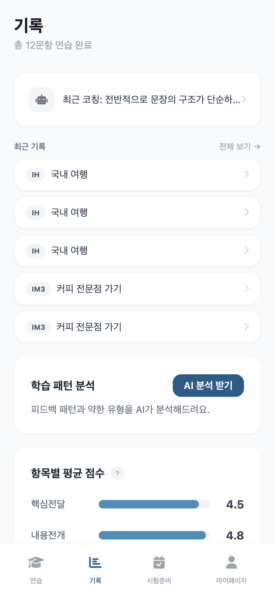
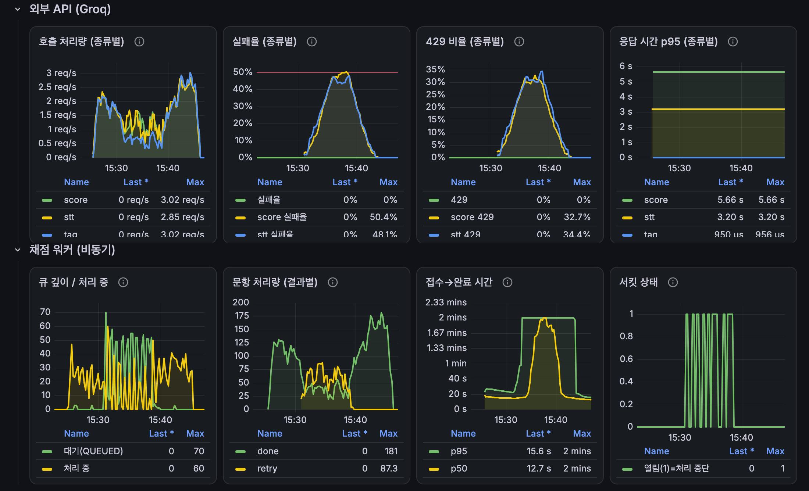

<div align="center">

# OPIcnic

**OPIc 말하기 연습 서비스**<br>답변을 녹음하면 등급과 고친 문장을 주고, 쌓인 답변에서 반복되는 버릇을 찾아 시험일까지 할 일을 정해 줍니다.

[](https://openjdk.org/projects/loom/)
[](https://spring.io/projects/spring-boot)
[](https://ai.google.dev)
[](https://groq.com)
[](https://opicnic.xyz)

[**라이브 데모 →**](https://opicnic.xyz)



<sub>사이트의 "로그인 없이 둘러보기"로 같은 화면을 볼 수 있습니다. 예시 기록도 실제 채점 파이프라인으로 만든 결과입니다.</sub>

</div>

---

**목차**

- [무엇을 해 주나](#무엇을-해-주나)
- [주요 화면](#주요-화면)
- [아키텍처](#아키텍처)
- [핵심 지표](#핵심-지표)
- [주요 문제 해결](#주요-문제-해결)
- [기술 스택](#기술-스택)
- [실행](#실행)
- [배포](#배포)

---

## 무엇을 해 주나

OPIc은 배경설문으로 고른 주제와 정해진 출제 규칙으로 15문항이 나오고, 채점자가 전체 답변을 듣고 등급을 매깁니다. 준비하면서 영어 자체보다 번거로운 건 주제를 뭘 고를지, 오늘 뭘 연습할지, 내 답의 무엇이 문제인지를 매번 직접 판단하는 일이었습니다. OPIcnic은 이 판단들을 대신 내려 줍니다.

- **주제 고르기**: 온보딩에서 고득점에 불리한 선택지(직업 관련 등)는 처음부터 빼고 보여 줍니다.
- **연습 단위**: 콤보, 문제 유형, 주제, 돌발, 모의고사 중에서 고르면 실제 시험 출제 규칙대로 문제가 나옵니다.
- **문항 피드백**: 답변마다 등급(IM2, IH 등)을 알려 주고, 약한 문장을 인용해 고친 문장과 모범 답안을 줍니다. 모범 답안은 새로 지은 답이 아니라 내 답을 한 단계 위 수준으로 다시 쓴 것이고, 듣고 따라 말할 수 있습니다.
- **학습 패턴 분석**: 답변이 쌓이면 여러 답변에 반복되는 버릇(감정 없이 사실만 나열하기 등)과 유형별 약점, 이번 주 과제를 정리합니다.
- **시험 준비**: 시험일을 정하면 쌓인 기록으로 하루 목표와 약한 콤보·유형, 오래 안 한 유형을 정합니다. 예상 등급은 실제 시험처럼 IH 이상이면 롤플레이 문제 해결(12번), AL이면 비교·이슈(14·15번)에서도 그 수준이 나와야 인정합니다.

연습 단위별 구성은 다음과 같습니다.

| 단위 | 구성 |
|---|---|
| 콤보 | 한 주제로 2~3문항(묘사, 루틴, 경험 등). 실제 시험의 기본 단위 |
| 문제 유형 | 묘사, 경험, 롤플레이, 비교, 이슈 중 한 유형만 |
| 주제 | 배경설문에서 고른 주제 하나 |
| 돌발 | 배경설문에서 고르지 않은 주제(전용 23개) |
| 모의고사 | 자기소개와 콤보 5개(선택 주제 3, 돌발 2). 실제 시험과 같은 15문항 |

로그인 없이 둘러보기를 누르면 예시 기록과 학습 패턴 분석, 3주 뒤 시험 일정이 채워진 계정으로 바로 써 볼 수 있습니다. 방문자마다 별도 계정이고 7일 뒤 지워지며, 무료 LLM 한도 때문에 채점은 하루 6문항까지입니다.

---

## 주요 화면

**1. 문항 피드백**: 내 답변(IM2)과, 같은 답을 한 단계 위로 다시 쓴 모범 답안

<p align="center">

</p>

**2. 학습 패턴 분석**: 요약과 예상 등급, 반복되는 버릇과 근거 문장, 유형별 약점과 이번 주 과제

<p align="center">
  
</p>

- 문항을 채점할 때 버릇 태그(감정 누락, 기본 어휘 위주 등)를 함께 붙이고, 리포트를 만들 때 코드가 태그를 답변 단위로 셉니다. 3개 이상의 답변에서 나온 태그만 약점으로 올리고, 화면에도 "12개 중 8개 답변"처럼 그 횟수를 보여 줍니다. LLM은 집계 결과를 문장으로 쓰는 데만 쓰고, 예시 문장은 코드가 실제 답변에서 고릅니다.
- 예상 등급은 최근 답변 15개의 등급 중앙값입니다. 등급 기준은 등급이 공개된 실제 답변 사례로 다시 잡았고, 정답 범위를 정해 둔 예시 답변 21개(검증용)에서 19개가 범위 안에 들었습니다(1회 측정, [보정 기록](docs/performance/2026-10-07-grading-calibration/README.md)).

**3. 시험 준비와 기록**: 남은 기간으로 하루 목표를 정하고, 기록이 적거나 점수가 낮은 콤보·유형을 먼저 추천

<p align="center">
 
</p>

---

## 아키텍처


1. 녹음이 끝나면 브라우저가 presigned URL로 녹음 파일을 S3(Cloudflare R2)에 직접 올립니다. 서버는 파일을 받지 않습니다.
2. 제출하면 서버는 채점 작업을 DB에 기록하고 바로 202로 응답합니다.
3. 워커가 DB에서 문항 단위로 작업을 집어 S3의 녹음을 읽고, STT와 채점을 호출해 문항별로 저장합니다. 외부 API가 실패하면 워커가 재시도합니다.
4. 브라우저는 결과를 폴링해 끝난 문항부터 보여줍니다.

녹음 파일(S3)과 채점 작업(DB)이 요청 밖에 있어서, 사용자가 화면을 떠나거나 서버가 재시작돼도 채점이 이어집니다.

설계 기준은 MAU 24만, 피크 동시 채점 30건을 가정했습니다. 목표는 접수 응답 p95 0.5초 이내, 이탈·재시작에도 채점 완료율 100%, 외부 API 일시 장애에도 실패 문항 0입니다([`docs/performance/slo.md`](docs/performance/slo.md)).

---

## 핵심 지표

<table>
<tr>
<td align="center">
<strong>7.6s → 0.03s</strong><br>
<sub>채점 접수 응답 p95(동시 30명)<br>비동기 전환(S3 + DB 큐 워커)</sub>
</td>
<td align="center">
<strong>22.8% → 0%</strong><br>
<sub>외부 API 45% 실패 주입 시 실패 문항<br>횟수 대신 시간 기준 재시도</sub>
</td>
<td align="center">
<strong>270s → 54s</strong><br>
<sub>장애 복구 후 채점 완료(429 33% → 0.4%)<br>full jitter + 워커 동시성 제한</sub>
</td>
<td align="center">
<strong>19 / 21</strong><br>
<sub>예시 답변 등급이 정답 범위 안<br>실제 등급 사례로 기준 재보정</sub>
</td>
</tr>
</table>

---

## 주요 문제 해결

- **채점 비동기 전환**: 녹음 파일을 서버 메모리에 올려 요청 안에서 채점하다 보니, 장애가 나면 녹음이 사라지고 재시도도 요청 시간 안에서만 할 수 있었습니다. 녹음은 S3에 직접 올리고 채점은 DB 큐의 워커가 재시도까지 맡도록 바꿔, 접수는 바로 응답하고 외부 장애는 뒤에서 흡수합니다.

  <details>
  <summary>자세히</summary>

  **문제 원인**
  - 음성 답변을 외부 API(STT, LLM)로 채점하며, 녹음 파일을 서버 메모리에 올려 요청 안에서 동기 처리
  - 재시도와 채점 결과가 요청에 묶여 있어 요청이 끊기면 함께 사라지는 구조
  - 서버 재시작이나 사용자 이탈 시 결과가 유실되고, 외부 API가 실패하면 사용자가 1분 넘는 답변을 다시 녹음

  **해결 과정**
  - 채점을 요청에서 떼어 비동기 작업으로 분리하고, 재시도와 결과 보존은 서버가 담당
  - 녹음 파일은 서버 디스크나 메모리 대신 S3에 두고 presigned URL로 직접 업로드해, 서버 재시작에도 남고 서버 메모리를 거치지 않게 처리
  - 채점 작업은 Kafka 같은 별도 큐 대신 DB 큐에 기록해 결과 저장과 상태 변경을 한 트랜잭션으로 처리, 워커가 문항 단위로 채점
  - 사용자가 응답을 기다리지 않게 되어, 재시도 한도를 횟수(3회) 대신 접수 후 시간 기준으로 늘려 지수 백오프
  - 실패를 기다리면 풀리는지로 나눠, 녹음 파일 문제는 즉시 실패, 429와 5xx, 타임아웃만 재시도
  - 몇 초 늦게 보여도 되는 채점 결과라, 연결을 서버에 유지해야 하는 SSE나 롱폴링 대신 요청마다 DB를 읽는 숏폴링으로 단순하게 응답
  - 테스트: 접수 직후와 채점 중 각각 서버 프로세스를 kill하고 재기동, 로컬에서 가짜 외부 API로 호출의 45%를 실패시키는 장애 주입

  **결과**
  - 채점을 비동기 작업으로 분리해 서버 재시작이나 사용자 이탈에도 채점 완료율 100%
  - 외부 API 일시 장애를 서버 재시도로 흡수해 사용자가 답변을 다시 녹음하지 않도록 개선 (45% 장애 주입 시 실패 문항: 재시도 3회 제한 22.8% → 시간 기준 재시도 0%)
  - 녹음 파일이 서버 메모리를 거치지 않아 힙 부담 감소 (Humongous GC 5분당 25회 → 3회)

  더 자세히: [블로그 글](https://velog.io/@niletheking/techdeepdive) / [설계 기록 (ADR)](docs/adr/0001-async-r2.md)

  </details>

- **재시도 폭주 방지**: 외부 API가 복구되는 순간 밀린 재시도가 한꺼번에 몰려 제공자 한도를 다시 넘겼습니다. full jitter 지수 백오프로 재시도 시점을 흩고 워커 동시성을 제한해, 기존 백오프 대비 복구 후 채점 완료가 270초에서 54초로, 429 비율이 33%에서 0.4%로 줄었습니다.

  <details>
  <summary>자세히</summary>

  **문제 원인**
  - 채점을 비동기 워커로 옮긴 뒤, 외부 API(STT, LLM)가 실패하면 워커가 지수 백오프로 재시도하는 구조
  - 외부 API가 복구되는 순간 밀려 있던 재시도가 한꺼번에 몰려, 막 복구된 제공자에 다시 과부하를 줄 수 있는 구조
  - 과부하로 거절된 호출(429)이 다시 재시도를 부르며 복구 뒤에도 채점 완료가 늦어질 수 있음

  **해결 과정**
  - mock 외부 API로 60초 장애 후 복구(복구 직후 초당 10건 처리)를 재현해 재시도 방식 세 가지를 비교
    - 즉시 재시도: 복구 순간 처리량의 9배가 몰려 429 78%
    - 2배씩 늘린 대기 + 1초 jitter: 호출은 줄었지만 대기가 60초 상한에 붙어 모든 문항이 60초마다 같은 박자로 몰림
  - 대기 시간 자체가 아니라 대기 범위를 2배씩 늘리고, 실제 대기는 그 범위 안에서 무작위로 고르는 full jitter(AWS SDK 기본 재시도 방식)로 재시도 시점 분산
  - 워커 동시 처리 수를 제한해 한 번에 나가는 외부 호출 상한 고정

  

  **결과**
  - 기존 백오프 대비 복구 후 채점 완료 270초 → 54초, 거절된 호출(429) 33% → 0.4%
  - 복구 직후 초당 최대 호출 39 → 12로 제공자가 처리할 수 있는 양 안에서 고르게 분산
  - 즉시 재시도 대비 외부 호출 87% 감소

  (mock 외부 API로 테스트: 콤보 30건, 60초 장애 후 복구, 복구 직후 초당 10건 처리)

  더 자세히: [실험 기록](docs/performance/2026-09-26/retry-storm.md)

  </details>

- **커넥션 경합 해소**(동기 구조 시절): 재시도할 때마다 문항 정보를 DB에서 다시 읽어 부하 중 커넥션 경합이 생겼습니다. 문항 정보를 연습 상태와 함께 Caffeine 인메모리 저장소에 두고 불필요한 트랜잭션을 걷어내, 제출 p95가 20.5초에서 3.73초로 줄었습니다.

  <details>
  <summary>자세히</summary>

  재시도·재전송 구조를 넣은 뒤, 답변을 채점할 때마다 문항을 DB에서 다시 읽는 경로가 부하 중 커넥션 경합을 일으켰습니다. 문항 정보를 인메모리 저장소에서 읽게 하고, 캐시에서 읽을 때도 커넥션을 먼저 잡던 `@Transactional` 경계를 없애 DB를 거치지 않는 경로로 만들었습니다. 제출 p95 20.5초 → 3.73초(mock 외부 API, 500VU).

  </details>

- **문항 병렬 처리**(동기 구조 시절): 콤보 3문항을 차례로 채점해 외부 API 대기가 문항 수만큼 쌓였습니다. 문항마다 가상 스레드로 나눠 병렬로 처리해 채점 시간이 12.9초에서 4.7초로 줄었습니다.

  <details>
  <summary>자세히</summary>

  `StructuredTaskScope`로 문항을 병렬로 채점하고, 하나가 실패하면 나머지를 취소했습니다. 직렬 12,886ms → 병렬 4,719ms(2.7배).

  지금은 비동기 워커가 문항을 각각 독립된 작업으로 가상 스레드에서 처리합니다.

  </details>

- **코칭 리포트 역할 분리**: 처음엔 답변 묶음을 LLM에 통째로 주고 패턴을 찾게 했더니 "오류가 거의 없는데 시제가 적절하지 않다"처럼 앞뒤가 안 맞는 진단이 나왔습니다. 답변 하나에 대한 판단(태그)만 LLM이 하고, 세기와 문턱값, 묶기는 코드가 하도록 나눴습니다. 이후 잘한 점 태그 일부(VOCAB_RICH 등)가 약점으로 세어지던 버그도 이 집계 단계에서 찾아 고쳤습니다.
- **모니터링**: Prometheus, Grafana, Alertmanager로 앱 골든 시그널과 외부 API, 비동기 워커 큐를 봅니다. 알림은 서버 지표가 아니라 사용자가 겪는 증상(접수 실패, 채점 지연) 기준으로 걸었습니다.

  

  <sub>로컬 재현: 사용자 30명, 외부 API 45% 장애 8분 뒤 복구. 장애 중 실패율·429·재시도가 오르지만 복구 후 밀린 문항이 처리되어 최종 실패 0</sub>

<details>
<summary><strong>비동기 전환 이전(동기 구조)의 기록</strong></summary>

- **디스크 I/O 병목 제거**: DB 풀 확장과 가상 스레드 pinning 가설을 1KB 격리 실험과 JFR로 하나씩 기각하고, 톰캣 멀티파트 임시파일 쓰기가 원인임을 찾았습니다. 멀티파트 임계치를 올려 디스크 쓰기를 없애 RPS 96 → 652, 평균 지연 1,100ms → 249ms(2026-04, mock 외부 API, 단일 실행). 함께 넣은 InputStream 릴레이는 6월에 재시도 때문에 되돌렸습니다(아래 접기).

  <details>
  <summary>2026-04 당시 전후 구조 (릴레이는 이후 되돌림)</summary>

  ```mermaid
  flowchart LR
      subgraph BEFORE["BEFORE — Heap Copy"]
          direction LR
          b1(["Request"]) --> b2["Tomcat"] --> b3["getBytes()\nbyte[] 1MB 힙 적재"] --> b4["ByteArrayResource"] --> b5["STT API"]
      end
      subgraph AFTER["AFTER — InputStream Relay"]
          direction LR
          a1(["Request"]) --> a2["Tomcat"] -->|"InputStream relay"| a3["STT API"]
      end
      BEFORE -.->|"Avg 1,100ms → 249ms · RPS 96 → 652"| AFTER
  ```

  4월에는 (1) `file-size-threshold: 2MB`로 톰캣 임시파일 쓰기를 없애고, (2) `InputStream` 릴레이로 힙 복사를 없앴습니다. 6월에 STT·LLM 자동 재시도가 필요해지자 스트림을 다시 읽을 수 없어 `byte[]` 버퍼링으로 되돌렸고(`docs/local/2026-06-06`), 지금 코드에는 (1)만 남아 있습니다. 되돌린 힙 적재의 비용은 2026-09 부하 테스트에서 GC 압박으로 드러났고, 녹음을 오브젝트 스토리지에 직접 올리는 구조로 바꾼 근거가 됐습니다(`docs/adr/0001-async-r2.md`).

  </details>

- **외부 API 장애 대응**: 외부 STT·LLM 일시 장애로 녹음이 사라지지 않도록 서버에서 지수 백오프로 3회 재시도하고, 실패한 문항만 다시 보내게 했습니다. 문제 본문은 서버가 갖고 있어 재전송 때도 LLM 입력을 믿을 수 있습니다. 지금은 비동기 워커의 시간 기준 재시도로 바뀌었습니다.

</details>

---

## 기술 스택

| | |
|---|---|
| **Language / Runtime** | Java 21, Virtual Threads |
| **Framework** | Spring Boot 3.4, Spring AI, Spring Security OAuth2 |
| **AI / STT** | Groq Whisper(STT), Gemini 3.5 Flash-Lite(채점, 태깅, 코칭 작성, 무료 등급). 공급자 설정은 `application-<공급자>.yml`로 나눠 `LLM_PROVIDER`로 고릅니다 |
| **Database** | MySQL 8.0, Spring Data JPA (채점 작업 큐 겸용) |
| **Storage** | Cloudflare R2 (S3 API, presigned URL 직접 업로드) |
| **Cache** | Caffeine (제출 전 연습 상태), ConcurrentHashMap (문제 세트) |
| **Rate Limiting** | Bucket4j (사용자별 시간당 15문항) |
| **Infra** | Oracle Cloud ARM A1 (4 OCPU, 24GB), Docker Compose, Cloudflare |
| **Monitoring** | Prometheus, Grafana, Alertmanager (Discord), Micrometer |

---

## 실행

```bash
cp .env.example .env          # DB_USERNAME/DB_PASSWORD, GROQ_API_KEY(STT), LLM_PROVIDER=gemini와 GEMINI_API_KEY(채점)
docker-compose up -d mysql    # MySQL만(전체를 올리면 앱 컨테이너가 8080을 먼저 잡음)
set -a && source .env && set +a
./gradlew bootRun
```

- `STT_ENABLED=false LLM_ENABLED=false`로 실행하면 외부 API 없이 mock 응답으로 동작합니다.
- R2 키(`R2_*`)가 비어 있으면 인메모리 저장소로 기동합니다(로컬 확인용, 재시작 시 녹음 유실).

## 배포

```bash
cp .env.example .env          # 운영 값, DISCORD_WEBHOOK_URL(없으면 중단), R2 키
./deploy.sh
```

`Cloudflare → host Nginx (SSL 종료) → App Nginx → Spring Boot` 구조로 동일 VM에 여러 서비스를 운영합니다. Grafana는 외부에 열지 않고 SSH 터널로 접근합니다.
