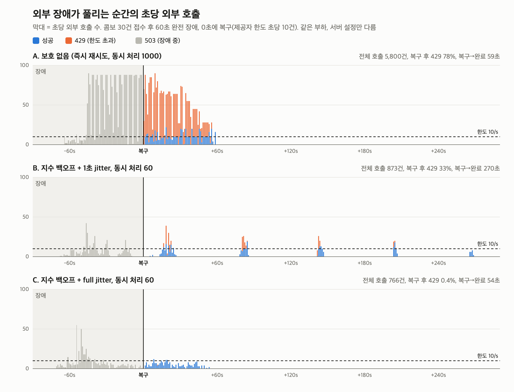

<div align="center">

# OPIcnic

**OPIc 전용 AI 피드백 서비스**<br>실제 시험 콤보 규칙으로 문제를 내고, OPIc 루브릭으로 문항별 피드백을, 누적된 답변으로 반복 습관을 잡아내는 코칭 리포트를 제공합니다.

[](https://openjdk.org/projects/loom/)
[](https://spring.io/projects/spring-boot)
[](https://groq.com)
[](https://opicnic.xyz)

[**라이브 데모 →**](https://opicnic.xyz)


</div>

---

**목차**

- [프로젝트 개요](#프로젝트-개요)
- [주요 화면](#주요-화면)
- [주요 기능](#주요-기능)
- [아키텍처](#아키텍처)
- [핵심 지표](#핵심-지표)
- [주요 문제 해결](#주요-문제-해결)
- [기술 스택](#기술-스택)
- [실행](#실행)
- [배포](#배포)

---

## 프로젝트 개요

> OPIc은 정해진 콤보 규칙대로 문제 세트가 구성되고 ACTFL 루브릭으로 채점되는 시험입니다. 그런데 수험생이 실제로 힘들어하는 지점은 채점 자체보다, **"무엇을, 어떤 순서로 공부해야 하는지"를 매번 스스로 판단하는 과정**입니다.

OPIcnic은 주제 선택부터 문제, 피드백, 코칭, 학습 계획까지 학습 사이클 전체의 판단을 대신 떠맡습니다.

| 수험생이 매번 고민하던 것 | OPIcnic이 대신 해주는 것 |
|---|---|
| 어떤 주제부터 골라야 할지 모르겠음 | 고득점에 불리한 선택지(직업 관련 주제 등)는 온보딩에서 아예 제외 — 남은 것 중에서만 고르면 됨 |
| 문제가 실제 시험이랑 다르게 나오면 연습한 보람이 없음 | 실제 시험 콤보 규칙 그대로 재현해 출제 |
| 오늘 뭘, 얼마나 풀어야 하는지 매번 판단해야 함 | 콤보 진행률·이번 주 과제·오래 방치한 유형까지 오늘 할 일 화면 하나로 안내 |
| 이 답변이 시험 기준으로 괜찮은 건가 | OPIc 전용 루브릭으로 문항별 피드백 |
| 반복되는 약점을 스스로 못 찾겠음 | 누적된 답변에서 패턴을 잡아내는 코칭 리포트 |
| 시험 전까지 뭘 언제 해야 하지 | 시험일까지 남은 기간 기준으로 학습 계획 역산 |

---

## 주요 화면

**1. 온보딩 — 배경설문**
<br>고득점에 불리한 선택지는 처음부터 제외하고, 남은 것 중에서만 고르면 됩니다.


**2. 연습 — 문제 풀이 · 녹음**
<br>실제 시험 콤보 규칙 그대로 재현된 문제로 연습합니다.


**3. 코칭 리포트**
<br>누적된 답변에서 반복되는 패턴을 잡아냅니다.


---

## 주요 기능

- **실제 시험 규칙 출제**: 콤보(주제별 2~3문항), 유형별 연습, 돌발 주제, 15문항 모의고사를 실제 OPIc 콤보 규칙대로 구성
- **문항별 피드백**: 음성 답변을 STT로 받아 OPIc 루브릭 항목별 점수와 개선 문장 제공, 채점이 끝난 문항부터 표시
- **코칭 리포트**: 누적된 답변에서 반복되는 약점 패턴을 요소별, 유형별로 정리
- **오늘 할 일과 학습 계획**: 시험일까지 남은 기간으로 일일 목표를 역산하고, 오래 안 한 유형과 약점 유형을 추천
- **온보딩**: 배경설문에서 고득점에 불리한 선택지를 처음부터 제외

---

## 아키텍처


1. 녹음이 끝나면 브라우저가 presigned URL로 녹음 파일을 S3(Cloudflare R2)에 직접 올립니다. 서버는 파일을 받지 않습니다.
2. 제출하면 서버는 채점 작업을 DB에 기록하고 바로 202로 응답합니다.
3. 워커가 DB에서 문항 단위로 작업을 집어 S3의 녹음을 읽고, STT와 채점을 호출해 문항별로 저장합니다. 외부 API가 실패하면 워커가 재시도합니다.
4. 브라우저는 결과를 폴링해 끝난 문항부터 보여줍니다.

녹음 파일(S3)과 채점 작업(DB)이 요청 밖에 있어서, 사용자가 화면을 떠나거나 서버가 재시작돼도 채점이 이어집니다.

**설계 기준**: MAU 24만 가정, 피크 동시 채점 30건 / 접수 응답 p95 0.5s 이내, 이탈 및 재시작 시 채점 완료율 100%, 외부 API 일시 장애 시 실패 문항 0 ([`docs/performance/slo.md`](docs/performance/slo.md))

---

## 핵심 지표

<table>
<tr>
<td align="center">
<strong>7.6s → 0.02s</strong><br>
<sub>채점 접수 응답<br>비동기 전환 (S3 + DB 큐 워커)</sub>
</td>
<td align="center">
<strong>78% → 0.4%</strong><br>
<sub>장애 복구 시 429 비율<br>full jitter + 워커 동시성 제한</sub>
</td>
<td align="center">
<strong>80%↓</strong><br>
<sub>채점 제출 p95 레이턴시<br>커넥션 경합 해소</sub>
</td>
<td align="center">
<strong>2.7×</strong><br>
<sub>채점 레이턴시<br>문항별 가상 스레드 병렬 처리</sub>
</td>
</tr>
</table>

---

## 주요 문제 해결

- **채점 비동기 전환**: 음성 파일을 서버 인메모리로 동기 처리하는 구조에서, 장애 시 파일 유실 및 재시도 한계 발생. 파일 presigned S3 업로드 및 DB 큐 기반 워커가 재시도까지 맡는 비동기 구조로 전환 → 접수만 빠르게 동기 응답하고 외부 장애 흡수

  <details>
  <summary>자세히</summary>

  **문제 원인**
  - 음성 답변을 외부 API(STT, LLM)로 채점하며, 녹음 파일을 서버 메모리에 올려 요청 안에서 동기 처리
  - 재시도와 채점 결과가 요청에 묶여 있어 요청이 끊기면 함께 사라지는 구조
  - 서버 재시작이나 사용자 이탈 시 결과가 유실되고, 외부 API가 실패하면 사용자가 1분 넘는 답변을 다시 녹음

  **해결 과정**
  - 채점을 요청에서 떼어 비동기 작업으로 분리하고, 재시도와 결과 보존은 서버가 담당
  - 녹음 파일은 서버 디스크나 메모리 대신 S3에 두고 presigned URL로 직접 업로드해, 서버 재시작에도 남고 서버 메모리를 거치지 않게 처리
  - 채점 작업은 Kafka 같은 별도 큐 대신 DB 큐에 기록해 결과 저장과 상태 변경을 한 트랜잭션으로 처리, 워커가 문항 단위로 채점
  - 사용자가 응답을 기다리지 않게 되어, 재시도 한도를 횟수(3회) 대신 접수 후 시간 기준으로 늘려 지수 백오프
  - 실패를 기다리면 풀리는지로 나눠, 녹음 파일 문제는 즉시 실패, 429와 5xx, 타임아웃만 재시도
  - 몇 초 늦게 보여도 되는 채점 결과라, 연결을 서버에 유지해야 하는 SSE나 롱폴링 대신 요청마다 DB를 읽는 숏폴링으로 단순하게 응답
  - 테스트: 접수 직후와 채점 중 각각 서버 프로세스를 kill하고 재기동, 로컬에서 가짜 외부 API로 호출의 45%를 실패시키는 장애 주입

  **결과**
  - 채점을 비동기 작업으로 분리해 서버 재시작이나 사용자 이탈에도 채점 완료율 100%
  - 외부 API 일시 장애를 서버 재시도로 흡수해 사용자가 답변을 다시 녹음하지 않도록 개선 (45% 장애 주입 시 실패 문항: 재시도 3회 제한 22.8% → 시간 기준 재시도 0%)
  - 녹음 파일이 서버 메모리를 거치지 않아 힙 부담 감소 (Humongous GC 5분당 25회 → 3회)

  더 자세히: [블로그 글](https://velog.io/@niletheking/techdeepdive) / [설계 기록 (ADR)](docs/adr/0001-async-r2.md)

  </details>

- **재시도 폭주 방지**: 외부 API 장애 복구 시 재시도가 동시에 몰려 제공자 처리 한도를 넘기는 문제 발생. full jitter 지수 백오프로 재시도 시점을 분산하고 워커 동시성을 제한 → 외부 호출 87% 감소, 한도 초과(429) 비율 78% → 0.4%

  <details>
  <summary>자세히</summary>

  **문제 원인**
  - 채점을 비동기 워커로 옮긴 뒤, 외부 API(STT, LLM)가 실패하면 워커가 지수 백오프로 재시도하는 구조
  - 외부 API가 복구되는 순간 밀려 있던 재시도가 한꺼번에 몰려, 막 복구된 제공자에 다시 과부하를 줄 수 있는 구조
  - 과부하로 거절된 호출(429)이 다시 재시도를 부르며 복구 뒤에도 채점 완료가 늦어질 수 있음

  **해결 과정**
  - mock 외부 API로 60초 장애 후 복구(복구 직후 초당 10건 처리)를 재현해 재시도 방식 세 가지를 비교
    - 즉시 재시도: 복구 순간 처리량의 9배가 몰려 429 78%
    - 2배씩 늘린 대기 + 1초 jitter: 호출은 줄었지만 대기가 60초 상한에 붙어 모든 문항이 60초마다 같은 박자로 몰림
  - 대기 시간 자체가 아니라 대기 범위를 2배씩 늘리고, 실제 대기는 그 범위 안에서 무작위로 고르는 full jitter(AWS SDK 기본 재시도 방식)로 재시도 시점 분산
  - 워커 동시 처리 수를 제한해 한 번에 나가는 외부 호출 상한 고정

  

  **결과**
  - 기존 백오프 대비 복구 후 채점 완료 270초 → 54초, 거절된 호출(429) 33% → 0.4%
  - 복구 직후 초당 최대 호출 39 → 12로 제공자가 처리할 수 있는 양 안에서 고르게 분산
  - 즉시 재시도 대비 외부 호출 87% 감소

  (mock 외부 API로 테스트: 콤보 30건, 60초 장애 후 복구, 복구 직후 초당 10건 처리)

  더 자세히: [실험 기록](docs/performance/2026-09-26/retry-storm.md)

  </details>

- **커넥션 경합 해소**: 문항 채점 중 재시도마다 대상 문항 정보를 DB에서 다시 조회해 발생한 커넥션 경합 발생. Caffeine 캐시 도입 → p95 레이턴시 80% 개선

  <details>
  <summary>자세히</summary>

  재시도/재전송 구조 도입 이후, 답변 채점마다 대상 문항을 DB에서 다시 조회하는 경로가 부하 상황에서 커넥션 경합을 일으켰습니다. 인메모리 캐시로 반복 조회를 제거할 기반을 만들고, 캐시 히트에도 커넥션을 선점하던 이전 `@Transactional` 경계를 함께 제거해 DB 조회·커넥션 획득이 없는 경로를 완성하여 **제출 p95 20.5s → 3.73s 개선** (동기 구조 시절, Mock, 500VU)

  </details>

- **문항 병렬 처리**: 3문항 채점 시 문항을 순차 처리해 외부 API 대기가 누적되는 문제 발생. 문항별 가상 스레드로 병렬 처리하여 레이턴시 2.7배 개선

  <details>
  <summary>자세히</summary>

  OPIc 콤보 2~3문항을 순차 채점 시 STT·LLM 외부 대기가 문항 수만큼 누적되어, `StructuredTaskScope`로 문항 간 병렬화(실패 시 나머지 취소)해 **기존 직렬 12,886ms → 병렬 실측 4,719ms 단축 (2.7배)**

  지금은 비동기 워커가 문항을 각각 독립된 작업으로 가상 스레드에서 처리합니다.

  </details>

- **코칭 리포트 일관성**: 학습기록을 기반으로 리포트를 제공하는 기능에서 LLM에 기록 집계 규칙(최소 빈도 미만 제외 등)을 프롬프트로 지시해도 지켜지지 않는 문제 발생. LLM은 항목별 분류만 맡기고 집계와 규칙 적용은 코드에서 처리하도록 분리 → 출력 일관성 확보

  <details>
  <summary>자세히</summary>

  코칭 리포트가 "오류가 거의 없는데 시제·어휘가 적절하지 않다"처럼 앞뒤 안 맞는 진단을 내는 문제가 발생. '패턴 카운팅'을 LLM에 통째로 맡긴 게 비결정론적 클러스터링이었기 때문임을 확인하고, 답변 단위 판단(LLM)과 집계·문턱값·그룹핑(결정론적 코드)으로 역할 분리해 해결

  </details>

- **모니터링**: Prometheus, Grafana, Alertmanager 기반 모니터링 스택 구축 → 앱 골든 시그널과 외부 API 의존성, 비동기 워커 큐 등 대시보드에서 관측. 사용자 증상 기준 알림으로 장애 대응 체계 구성

<details>
<summary><strong>비동기 전환 이전(동기 구조)의 기록</strong></summary>

- **디스크 I/O 병목 제거**: DB pool 확장·VT pinning 가설을 1KB 격리 실험과 JFR로 기각/특정한 뒤 톰캣 멀티파트 임시파일 쓰기가 원인임을 확인, 멀티파트 임계치를 올려 디스크 쓰기를 제거 — **RPS 96→652, Avg Latency 1,100ms→249ms** (2026-04, Mock STT/LLM, 단일 실행). 당시 함께 넣은 InputStream 릴레이는 6월 재시도 요구사항으로 되돌림 — 아래 접기 참고

  <details>
  <summary>2026-04 당시 전후 구조 (릴레이는 이후 되돌림)</summary>

  ```mermaid
  flowchart LR
      subgraph BEFORE["BEFORE — Heap Copy"]
          direction LR
          b1(["Request"]) --> b2["Tomcat"] --> b3["getBytes()\nbyte[] 1MB 힙 적재"] --> b4["ByteArrayResource"] --> b5["STT API"]
      end
      subgraph AFTER["AFTER — InputStream Relay"]
          direction LR
          a1(["Request"]) --> a2["Tomcat"] -->|"InputStream relay"| a3["STT API"]
      end
      BEFORE -.->|"Avg 1,100ms → 249ms · RPS 96 → 652"| AFTER
  ```

  4월엔 (1) `file-size-threshold: 2MB`로 톰캣 임시파일 쓰기 제거, (2) `InputStream` 릴레이로 힙 복사 제거 두 개를 같이 넣었다. 6월에 STT/LLM 자동 재시도가 필요해지면서 스트림을 다시 읽을 수 없어 `byte[]` 버퍼링으로 되돌렸고(`docs/local/2026-06-06`), 8월에 타입까지 정리했다. **지금 코드에 남은 건 (1)뿐이다.** 그 힙 적재의 비용은 2026-09 부하테스트에서 GC 압박으로 측정됐고, 오브젝트 스토리지 직접 업로드로 전환하는 근거가 됐다(`docs/adr/0001-async-r2.md`).

  </details>

- **외부 API 장애 대응**: 외부 STT/LLM 일시 장애로 인한 녹음 유실을, 서버 지수 백오프 3회 재시도 + 실패 문항만 재전송하는 구조로 방지 (문제 본문은 서버가 통제해 재전송 시에도 LLM 입력을 신뢰) (이후 비동기 전환으로 워커의 시간 기준 재시도로 대체)

</details>

---

## 기술 스택

| | |
|---|---|
| **Language / Runtime** | Java 21, Virtual Threads |
| **Framework** | Spring Boot 3.4, Spring AI, Spring Security OAuth2 |
| **AI / STT** | Groq Whisper (STT), gpt-oss-120b (채점, 코칭 작성), gpt-oss-20b (태깅). 모델 ID는 설정값으로 분리 |
| **Database** | MySQL 8.0, Spring Data JPA (채점 작업 큐 겸용) |
| **Storage** | Cloudflare R2 (S3 API, presigned URL 직접 업로드) |
| **Cache** | Caffeine (제출 전 연습 상태), ConcurrentHashMap (문제 세트) |
| **Rate Limiting** | Bucket4j (사용자별 시간당 15문항) |
| **Infra** | Oracle Cloud ARM A1 (4 OCPU, 24GB), Docker Compose, Cloudflare |
| **Monitoring** | Prometheus, Grafana, Alertmanager (Discord), Micrometer |

---

## 실행

```bash
cp .env.example .env          # DB_USERNAME/DB_PASSWORD/GROQ_API_KEY 채우기
docker-compose up -d mysql    # MySQL만 (전체를 올리면 앱 컨테이너가 8080을 먼저 잡음)
set -a && source .env && set +a
./gradlew bootRun
```

- `STT_ENABLED=false LLM_ENABLED=false`로 실행하면 외부 API 없이 mock 응답으로 동작합니다.
- R2 키(`R2_*`)가 비어 있으면 인메모리 저장소로 기동합니다(로컬 확인용, 재시작 시 녹음 유실).

## 배포

```bash
cp .env.example .env          # 운영 값 + DISCORD_WEBHOOK_URL(없으면 중단) + R2 키
./deploy.sh
```

`Cloudflare → host Nginx (SSL 종료) → App Nginx → Spring Boot` 구조로 동일 VM에 여러 서비스를 운영합니다. Grafana는 외부에 열지 않고 SSH 터널로 접근합니다.
