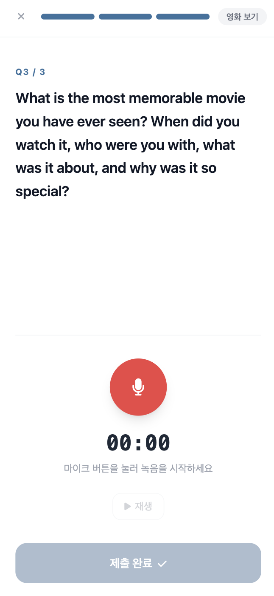
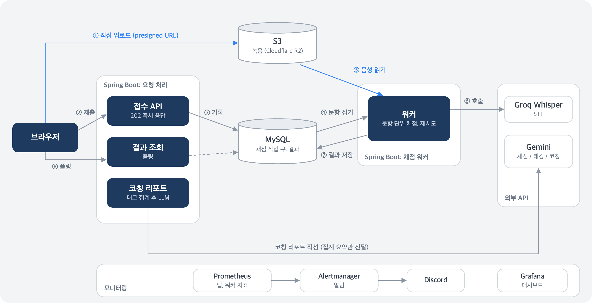

<div align="center">

# OPIcnic

**OPIc 전용 AI 피드백 서비스** — OPIc은 ACTFL 채점 기준을 따르는 시험이라 범용 영어 첨삭으로는 안 맞습니다. OPIcnic은 실제 시험 콤보 규칙으로 문제를 내고, OPIc 전용 루브릭으로 채점해 문항별 개별 피드백과, 여러 답변에 걸친 반복 습관을 잡아내는 코칭 리포트를 제공합니다.

[](https://openjdk.org/projects/loom/)
[](https://spring.io/projects/spring-boot)
[](https://groq.com)
[](https://opicnic.xyz)

[**라이브 데모 →**](https://opicnic.xyz)


</div>

---

**목차**

- [프로젝트 개요](#프로젝트-개요)
- [주요 화면](#주요-화면)
- [핵심 지표](#핵심-지표)
- [아키텍처](#아키텍처)
- [주요 문제 해결](#주요-문제-해결)
- [기술 스택](#기술-스택)
- [실행](#실행)
- [배포](#배포)

---

## 프로젝트 개요

> OPIc은 정해진 콤보 규칙대로 문제 세트가 구성되고 ACTFL 루브릭으로 채점되는 시험입니다. 그런데 수험생이 실제로 힘들어하는 지점은 채점 자체보다, **"무엇을, 어떤 순서로 공부해야 하는지"를 매번 스스로 판단하는 과정**입니다.

OPIcnic은 주제 선택부터 문제, 피드백, 코칭, 학습 계획까지 학습 사이클 전체의 판단을 대신 떠맡습니다.

| 수험생이 매번 고민하던 것 | OPIcnic이 대신 해주는 것 |
|---|---|
| 어떤 주제부터 골라야 할지 모르겠음 | 고득점에 불리한 선택지(직업 관련 주제 등)는 온보딩에서 아예 제외 — 남은 것 중에서만 고르면 됨 |
| 문제가 실제 시험이랑 다르게 나오면 연습한 보람이 없음 | 실제 시험 콤보 규칙 그대로 재현해 출제 |
| 오늘 뭘, 얼마나 풀어야 하는지 매번 판단해야 함 | 콤보 진행률·이번 주 과제·오래 방치한 유형까지 오늘 할 일 화면 하나로 안내 |
| 이 답변이 시험 기준으로 괜찮은 건가 | OPIc 전용 루브릭으로 문항별 피드백 |
| 반복되는 약점을 스스로 못 찾겠음 | 누적된 답변에서 패턴을 잡아내는 코칭 리포트 |
| 시험 전까지 뭘 언제 해야 하지 | 시험일까지 남은 기간 기준으로 학습 계획 역산 |

---

## 주요 화면

**1. 온보딩 — 배경설문**
<br>고득점에 불리한 선택지는 처음부터 제외하고, 남은 것 중에서만 고르면 됩니다.


**2. 연습 — 문제 풀이 · 녹음**
<br>실제 시험 콤보 규칙 그대로 재현된 문제로 연습합니다.


**3. 코칭 리포트**
<br>누적된 답변에서 반복되는 패턴을 잡아냅니다.


---

## 핵심 지표

<table>
<tr>
<td align="center">
<strong>100%</strong><br>
<sub>이탈·재시작 시 채점 완료율<br>접수 직후, 채점 중 서버 kill</sub>
</td>
<td align="center">
<strong>22.8% → 0%</strong><br>
<sub>외부 API 45% 장애 시 실패 문항<br>재시도 3회 제한 → 시간 기준</sub>
</td>
<td align="center">
<strong>270s → 54s</strong><br>
<sub>장애 복구 후 채점 완료<br>기존 백오프 → full jitter</sub>
</td>
<td align="center">
<strong>2.7×</strong><br>
<sub>문항 병렬 처리 (실음성)<br>12,886ms → 4,719ms</sub>
</td>
</tr>
</table>

---

## 아키텍처



1. 녹음이 끝나면 브라우저가 presigned URL로 녹음 파일을 S3(Cloudflare R2)에 직접 올립니다. 서버는 파일을 받지 않습니다.
2. 제출하면 서버는 채점 작업을 DB에 기록하고 바로 202로 응답합니다.
3. 워커가 DB에서 문항 단위로 작업을 집어 S3의 녹음을 읽고, STT와 채점을 호출해 문항별로 저장합니다. 외부 API가 실패하면 워커가 재시도합니다.
4. 브라우저는 결과를 폴링해 끝난 문항부터 보여줍니다.

녹음 파일(S3)과 채점 작업(DB)이 요청 밖에 있어서, 사용자가 화면을 떠나거나 서버가 재시작돼도 채점이 이어집니다.

**설계 기준**: MAU 24만 가정, 피크 동시 채점 30건 / 접수 응답 p95 0.5s 이내, 이탈 및 재시작 시 채점 완료율 100%, 외부 API 일시 장애 시 실패 문항 0 ([`docs/performance/slo.md`](docs/performance/slo.md))

---

## 주요 문제 해결

- **채점 비동기 전환**: 음성 파일을 인메모리로 동기 처리하는 구조에서 장애 시 파일 유실과 재시도 한계 발생. presigned URL로 S3에 직접 업로드하고 DB 큐 기반 워커가 재시도까지 맡는 비동기 구조로 전환 → 이탈, 재시작에도 채점 완료율 100%, 외부 장애 흡수 ([ADR](docs/adr/0001-async-r2.md))
- **재시도 폭주 방지**: 외부 API 장애 복구 시 재시도가 한꺼번에 몰려 제공자에 과부하를 주는 문제. full jitter 지수 백오프로 재시도 시점을 분산하고 워커 동시성을 제한 → 복구 후 채점 완료 270s → 54s, 거절된 호출(429) 33% → 0.4% ([실험](docs/performance/2026-09-26/retry-storm.md))
- **커넥션 경합 해소**: 채점 중 재시도마다 대상 문항을 DB에서 다시 조회해 커넥션 경합 발생. Caffeine 캐시 도입 → p95 레이턴시 80% 개선
- **문항 병렬 처리**: 3문항 채점 시 순차 처리로 외부 API 대기가 누적. 문항별 가상 스레드로 병렬 처리 → 레이턴시 2.7배 개선
- **코칭 리포트 일관성**: LLM에 집계 규칙을 프롬프트로 지시해도 실행마다 다르게 지켜지는 문제. LLM은 항목별 분류만, 집계와 규칙 적용은 코드가 맡도록 분리 → 출력 일관성 확보
- **모니터링**: Prometheus, Grafana, Alertmanager로 외부 API 의존성과 워커 큐를 관측하고, 사용자 증상 기준 알림으로 장애 대응 체계 구성

---

## 기술 스택

| | |
|---|---|
| **Language / Runtime** | Java 21, Virtual Threads |
| **Framework** | Spring Boot 3.4, Spring AI, Spring Security OAuth2 |
| **AI / STT** | Groq Whisper (STT), gpt-oss-120b (채점, 코칭 작성), gpt-oss-20b (태깅). 모델 ID는 설정값으로 분리 |
| **Database** | MySQL 8.0, Spring Data JPA (채점 작업 큐 겸용) |
| **Storage** | Cloudflare R2 (S3 API, presigned URL 직접 업로드) |
| **Cache** | Caffeine (제출 전 연습 상태), ConcurrentHashMap (문제 세트) |
| **Rate Limiting** | Bucket4j (사용자별 시간당 15문항) |
| **Infra** | Oracle Cloud ARM A1 (4 OCPU, 24GB), Docker Compose, Cloudflare |
| **Monitoring** | Prometheus, Grafana, Alertmanager (Discord), Micrometer |

---

## 실행

```bash
cp .env.example .env          # DB_USERNAME/DB_PASSWORD/GROQ_API_KEY 채우기
docker-compose up -d mysql    # MySQL만 (전체를 올리면 앱 컨테이너가 8080을 먼저 잡음)
set -a && source .env && set +a
./gradlew bootRun
```

- `STT_ENABLED=false LLM_ENABLED=false`로 실행하면 외부 API 없이 mock 응답으로 동작합니다.
- R2 키(`R2_*`)가 비어 있으면 인메모리 저장소로 기동합니다(로컬 확인용, 재시작 시 녹음 유실).

## 배포

```bash
cp .env.example .env          # 운영 값 + DISCORD_WEBHOOK_URL(없으면 중단) + R2 키
./deploy.sh
```

`Cloudflare → host Nginx (SSL 종료) → App Nginx → Spring Boot` 구조로 동일 VM에 여러 서비스를 운영합니다. Grafana는 외부에 열지 않고 SSH 터널로 접근합니다.
