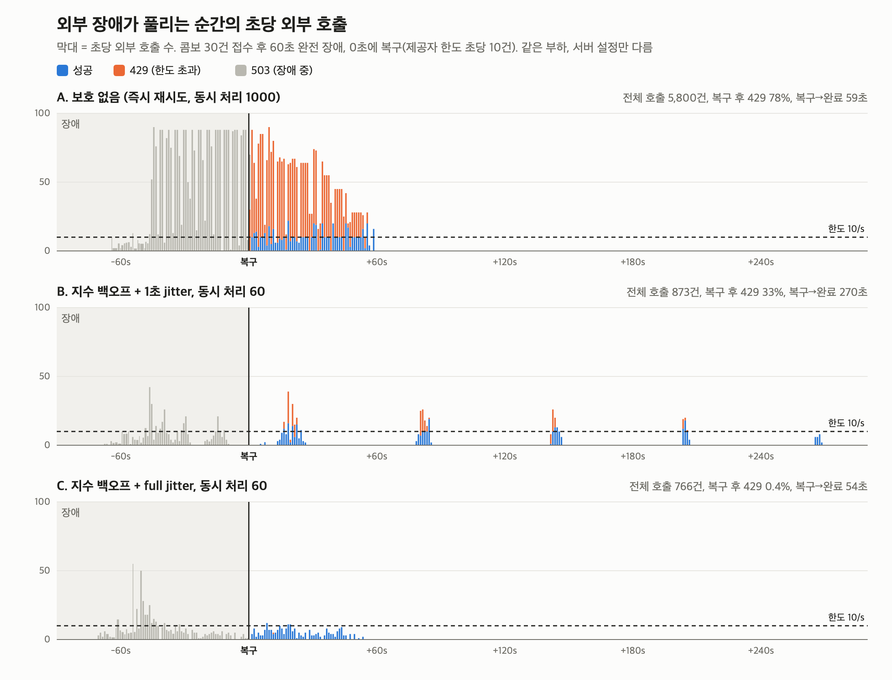

# 재시도 폭주 실험 (2026-09-26)

외부 장애가 났다가 풀리는 순간, 쌓인 재시도가 제공자에게 한꺼번에 몰리는가. 그리고 지수 백오프·동시 처리 수 제한이 그걸 막는가.

## 왜 따로 실험했나

S2(호출당 45% 확률 실패 주입)의 호출 증폭 1.83배는 백오프·동시 처리 제한의 효과가 **아니다**. 확률 주입은 몇 건을 부르든 실패율이 같아서, 성공까지 재시도하면 어떤 정책이든 기대 호출 수가 1/(1−p)로 같다. 백오프가 바꾸는 건 총 호출 수가 아니라 **호출이 몰리는 속도**다. 그걸 보려면 "많이 부를수록 더 실패하는" 제공자가 필요했다.

## 방법

- **가짜 제공자** (`MockProvider`, dev mock 경로 전용): STT·채점·태깅 합쳐 초당 10건만 받고 넘으면 즉시 429, 장애 중엔 모든 호출 즉시 503. 거절은 처리 지연 없이 바로 돌아온다.
- **시나리오** (`scripts/retry-storm.sh <라벨> 30 60 10`): 장애 상태에서 콤보 30건(문항 82~88) 접수 → 접수가 끝나고 60초 더 장애 → 복구(초당 10건 한도) → 잡이 전부 끝날 때까지 1초마다 `/actuator/prometheus` 기록.
- **세 설정** (`.claude/launch.json` storm-a / storm-b, 서킷은 모두 끔, mock 지연 STT 1s·LLM 1.5s):

| | 재시도 대기 | 동시 처리 |
|---|---|---|
| A 보호 없음 | 없음 (다음 폴링 1초 뒤) | 1000 |
| B 당시 설계 | 2s부터 2배, 상한 60s + 1초 미만 jitter | 60 |
| C 개선 | 같은 천장 안에서 0~천장 무작위 (full jitter) | 60 |

- 워커가 시도마다 R2에서 음성을 다시 읽는데, 랩탑 wifi에선 동시 읽기가 수십 초씩 걸려 그 대기가 재시도 속도를 대신 늦췄다(첫 A 실행에서 확인, 폐기). 실험에선 한 번 읽은 음성을 메모리에 두었다(`opicnic.storage.read-cache=true`, 실험 전용).

## 결과

| | A 보호 없음 | B 백오프 + 1초 jitter | C 백오프 + full jitter |
|---|---|---|---|
| 전체 외부 호출 | 5,800 | 873 | **766** (A 대비 −87%) |
| 장애 중 호출 | 3,064 (초당 평균 36.5) | 425 | 518 |
| 복구 후 429 비율 | 78% | 33% | **0.4%** |
| 복구 후 초당 최대 호출 (한도 10) | 90 | 39 | **12** |
| 복구 → 전부 완료 | 59s | 270s | **54s** |
| FAILED | 0 | 0 | 0 |

원본: `retry-storm-{a-no-protection,b-backoff-slots,c-full-jitter}.{txt,csv}`, 그림: `retry-storm-chart.py`.

## 읽은 것

1. **폭주는 실제로 생긴다 (A).** 장애 중엔 문항 수만큼 초당 88~90건을 두드리고, 복구 순간 그대로 한도의 9배가 몰려 78%가 429. 429를 받은 문항이 1초 뒤 또 오니 복구 후에도 한참 한도 위에 머문다.
2. **1초 jitter는 60초 천장 앞에서 아무것도 흩지 못한다 (B).** 장애가 60초 넘게 이어지자 모든 문항의 대기가 천장(60s)에 붙었고, jitter가 1초 미만이라 박자가 맞은 채로 60초마다 파도처럼 몰렸다. 한 파도에 10건만 통과하고 나머지는 429 → 다시 60초. 호출은 줄였지만 **복구 후 완료가 A보다 4.5배 느렸다** — 백오프만으로는 thundering herd를 못 막는다.
3. **대기를 천장 안 전체로 흩으면 둘 다 잡힌다 (C).** 복구 직후부터 한도 근처(최대 12)로 평평하게 흘러 429가 거의 없고, 헛호출이 없으니 완료도 A보다 빠르다.

## 한계

- 설정마다 1회 실행. 경향은 뚜렷하지만 분산은 재지 않았다.
- 제공자 한도는 "고정 1초 창, 받아들인 호출만 셈"으로 단순화한 모형. 실제 제공자(분당 한도, 토큰 한도)와 다르다.
- 장애 중 호출은 C가 B보다 조금 많다(518 vs 425) — full jitter는 평균 대기가 천장의 절반이라. 복구 후 절약이 그보다 크다.

## 반영

- `ScoringWorker.backoff`를 full jitter로 변경(같은 날). 운영 배포 필요.
