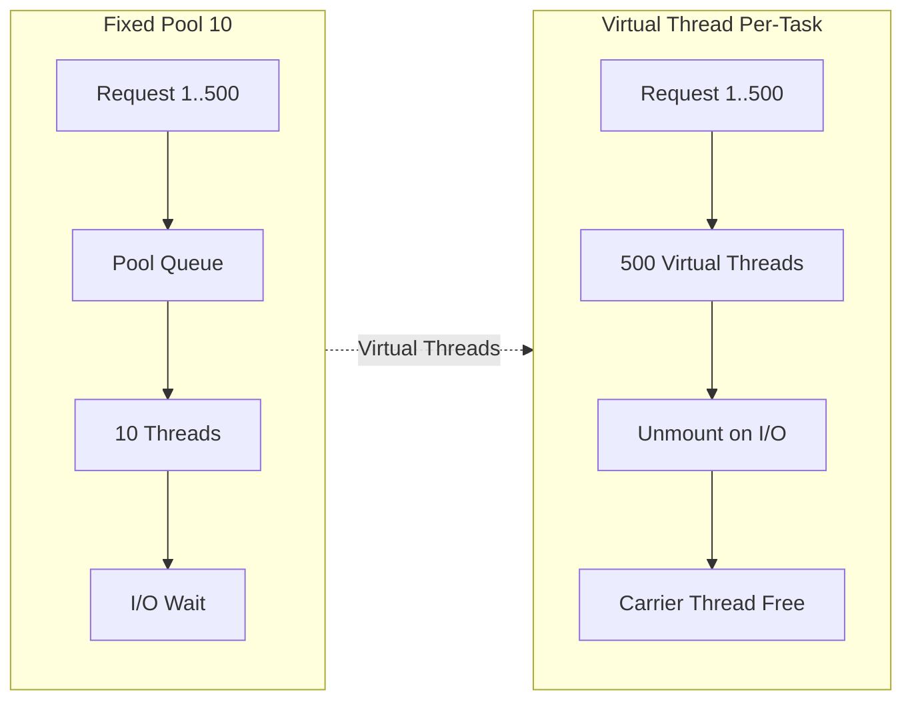

# [프로젝트] Opicnic — OPIc 시험 대비 AI 모의고사 및 피드백 서비스

**Java 21 가상 스레드와 I/O 파이프라인 최적화로 대규모 음성 데이터를 실시간 처리하는 AI 튜터링 플랫폼**

- **GitHub**: https://github.com/NileTheKing/opicnic
- **구조**: Spring Boot 3.4 (Core API) ↔ Python FastAPI (STT) ↔ Vertex AI (LLM) 분산 구조
- **스택**: Java 21 · Spring Boot · JPA · MySQL · RestClient · Python · Whisper · Gemini
- **규모**: 500 VU 기준 Peak 659 RPS · 초당 346 MB 데이터 전송 (k6 실측)
- **성과**: p95 Latency 1.13s → 659ms (42%↓) · 1KB 격리 테스트 시 p95 132ms 기록

**[서비스 개요 및 핵심 기능]**
- OPIc 시험의 콤보 문제(연속 질문) 특성을 반영하여 주제별 다건의 음성 답변을 동시 수집 및 분석하는 시스템 구현
- [STT 추출 ➡️ LLM 평가] 파이프라인을 병렬화하여 다수의 음성 파일 제출 시에도 즉각적인 AI 피드백 리포트 제공
- 대용량 바이너리 데이터 전송과 외부 API 대기 시간이 결합된 복합 병목 구간을 공학적 분석을 통해 최적화 완료

---

### **1. Java 21 가상 스레드 기반 구조적 병렬 처리로 동시성 확장성 확보**

> **RPS 96 → 659 (+580%) · 내부 큐잉 대기 시간 ~0ms 달성 (k6 실측)**

**문제**
- 초기 FixedThreadPool(10) 기반 설계 시 외부 I/O 대기 중 플랫폼 스레드가 차단되어 50명 동시 요청만으로 서버 마비
- 톰캣은 가상 스레드로 요청을 수용하나 내부 비즈니스 태스크가 한정된 스레드 풀에 갇혀 지연 시간이 1.1s로 폭증함
- 대규모 비동기 작업 처리 시 OS 스레드 간 컨텍스트 스위칭 비용으로 인해 CPU 자원이 스케줄링 연산에 과다 소모됨

**해결**
- 비동기 실행기(taskExecutor)를 VirtualThreadPerTaskExecutor로 전면 교체하여 스레드 생성 및 전환 비용 제거
- 외부 API 응답 대기 시 가상 스레드가 Carrier 스레드로부터 자동으로 분리되는 특성을 활용하여 물리 자원 효율 극대화
- ExecutorService.invokeAll() 기반의 구조적 병렬 처리로 리팩터링하여 비동기 콜백 오버헤드 및 Stack Trace 파편화 방지

**결과**
- 단일 요청 처리 속도 개선 없이 동시성 모델 최적화만으로 단일 인스턴스 RPS 6.8배 수직 상승 및 안정적 수용 확인
- 별도의 메시지 큐 인프라 도입 없이 런타임 동시성 모델 튜닝만으로 서버 가동 중단 위험 방어 및 가용성 개선 완료
- 플랫폼 스레드 점유 문제를 원천 해결하여 수천 개의 경량 태스크가 물리적 자원 한계치까지 확장 가능한 환경 구축

---

### **2. Troubleshooting: 변수 통제 격리 실험과 JFR 분석을 통한 I/O 병목 식별**

> **DB Pool·Pinning 요인 제외 → 1KB 격리 실험 및 JFR 분석 기반 Disk I/O 근본 원인 식별**

**문제**
- 가상 스레드 도입 후에도 500 VU 부하 시 p95 Latency가 1.1s에서 정체되는 지연 시간 임계점 현상 지속 발생
- DB 커넥션 풀(10→50) 확장 및 피닝(Pinning) 추적 옵션 가동 결과 지표 변화 0% 기록으로 기존 가설 모두 기각
- 실행 로그(server.log)의 표면적 지표인 DB 대기열(waiting) 정보에 매몰되어 실제 병목 지점 오인 위험 상존

**해결**
- 1MB 오디오 대신 1KB 가짜 파일로 부하 테스트를 수행하는 변수 통제 실험을 통해 파일 I/O가 핵심 지연 요인임을 식별
- JFR(Java Flight Recorder) 정밀 프로파일링을 가동하여 jdk.ObjectAllocationSample 및 Native Method 이벤트 전수 조사
- 톰캣의 멀티파트 기본 동작(10KB 초과 시 디스크 임시 저장)에 의한 Disk I/O Wait가 전체 지연의 핵심 원인임을 확정

**결과**
- 단순 설정 튜닝이 아닌 변수 통제 격리 실험(1KB vs 1MB)을 통해 병목 구간을 과학적으로 좁혀나가는 분석 역량 적용
- 실행 로그의 표면적 지표에 매몰되지 않고 하부 I/O 계층의 물리적 임계점을 정량적으로 도출하여 최적화 우선순위 확정
- p95 지연 시간 132ms급의 비즈니스 로직 잠재 속도를 확인하여 인프라 최적화가 성능 개선의 핵심임을 데이터로 증명

---

### **3. In-Memory 스트리밍 파이프라인 구축을 통한 물리적 지연 제거**

> **p95 Latency 1.13s → 659ms (42%↓) · OS 네트워크 버퍼 외 애플리케이션 계층 병목 완전 해소**

**문제**
- 500개 대용량 오디오 파일의 동시 업로드 시 발생하는 디스크 쓰기 루프가 응답 시간을 전송 완료 시점에 종속시킴
- 동기식 DEBUG 로깅 작업이 파일 시스템 락(Lock)을 유발하여 가상 스레드의 높은 병렬성을 저해하는 현상 확인
- 340MB/s 이상의 고대역폭 데이터 처리 시 OS 커널 소켓 버퍼 한계로 인한 no buffer space available 에러 발생

**해결**
- file-size-threshold를 2MB로 상향하여 1MB 오디오 데이터가 디스크를 거치지 않고 RAM에서만 처리되도록 유도
- InputStream Relay 구조를 구현하여 MultipartFile의 전체 버퍼링 과정을 우회하고 전송과 처리 간 병렬성 확보
- 로깅 레벨 최적화(DEBUG→INFO)를 통해 비즈니스 로직 외 불필요한 I/O 간섭 요인을 제거하고 처리 성능 극대화

**결과**
- 실제 파일(1MB) 처리 p95 지연 시간을 1.13s에서 659ms로 42% 단축 달성 및 디스크 쓰기에 의한 스레드 블로킹 제거
- 초당 346MB 전송 시 OS 레벨 병목 외 어플리케이션 계층 최적화 상태 확인으로 성능 확장성 한계치 도달 및 실측
- 메모리 내 스트리밍 처리를 통해 대규모 파일 수신 시 발생하는 가상 스레드의 힙 메모리 압박 및 CPU 부하 개선

---

### **4. Design: 도메인 모델링 최적화 및 비즈니스 변수 통제**

> **계층적 정규화를 통한 데이터 정합성 보장 · 전략 패턴을 활용한 벤치마크 노이즈 제거**

**문제**
- OPIc 시험 특성상 질문 간의 순서(묘사→경험→비교) 보장이 필수적이나 단순 CRUD 구조에서는 데이터 관계 파편화 위험 존재
- 무작위(Random) 출제 로직이 비즈니스 핵심부와 강하게 결합되어 있어 일관된 성능 측정을 위한 테스트 환경 구축 한계
- 대규모 요청 환경에서 비즈니스 로직과 데이터 추출 레이어 간의 역할 미분리로 인해 도메인 객체 오염 가능성 식별

**해결**
- QuestionSet ➡️ Combo ➡️ Question 3단계 정규화 설계를 통해 데이터 레벨에서 시험의 문맥적 사고 흐름을 강제
- Strategy Pattern을 적용하여 실제 운영용(Random)과 테스트용(Fixed) 출제 로직을 분리함으로써 성능 측정 편차 제거
- 콤보 내 순서 보장을 위한 sequence_in_combo 제약 조건을 강화하여 동시 요청 시에도 시험 데이터 정합성 완전 유지

**결과**
- 도메인 특화 모델 설계를 통해 복잡한 비즈니스 규칙을 단순화하고 신규 데이터 추가 시 발생 가능한 정합성 오류 차단
- 무작위 변수를 배제한 대조군/실험군 환경을 구축하여 비즈니스 로직의 노이즈 없는 순수 I/O 최적화 성능 정밀 실측
- 도메인 지식을 객체 구조에 반영하여 고부하 상황에서도 데이터의 신뢰성을 유지하는 견고한 백엔드 아키텍처 확보

---

### **💡 Architectural Decision: 가상 스레드와 구조적 동시성**
"Java 21 가상 스레드의 원리를 활용하여 복잡한 비동기 API 대신 구조적 동기 스타일로 병렬성을 구현함으로써 고성능과 가독성을 동시에 확보했습니다. 추측에 의존한 설정 변경을 배제하고 격리 실험과 JFR 분석을 통해 시스템 성능을 물리적 한계치까지 최적화한 사례입니다."
